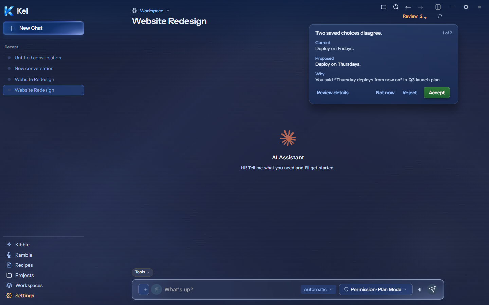
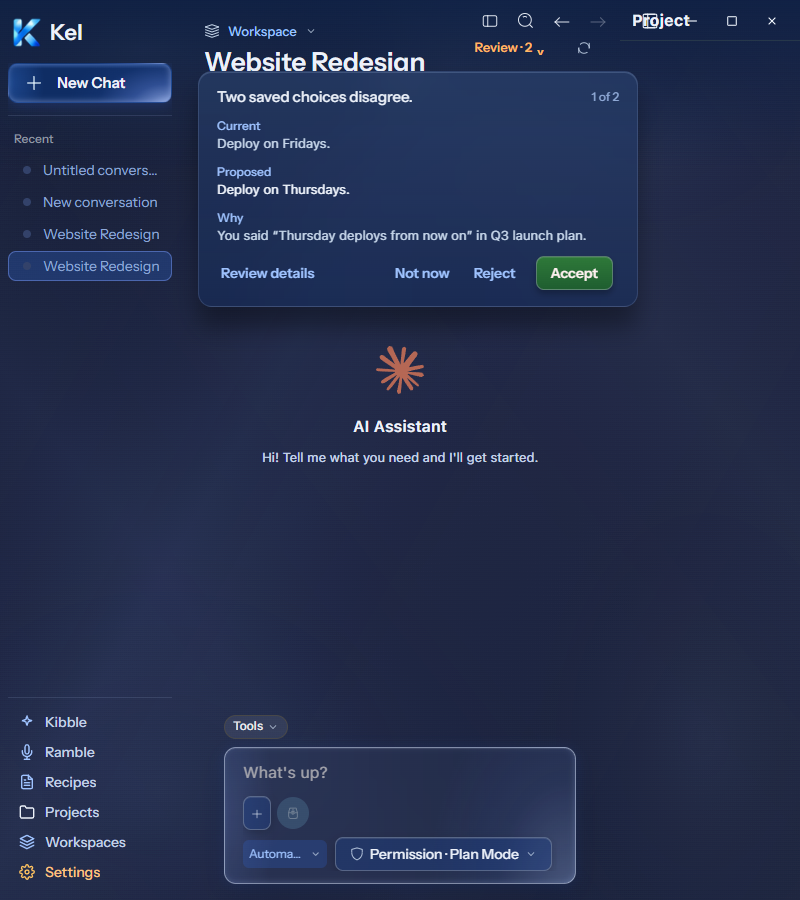
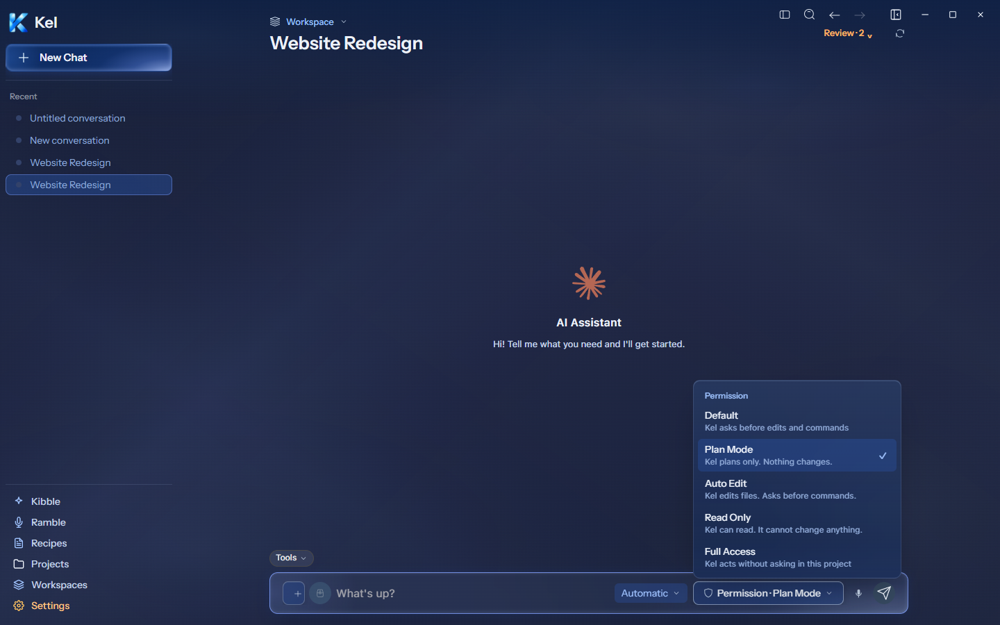
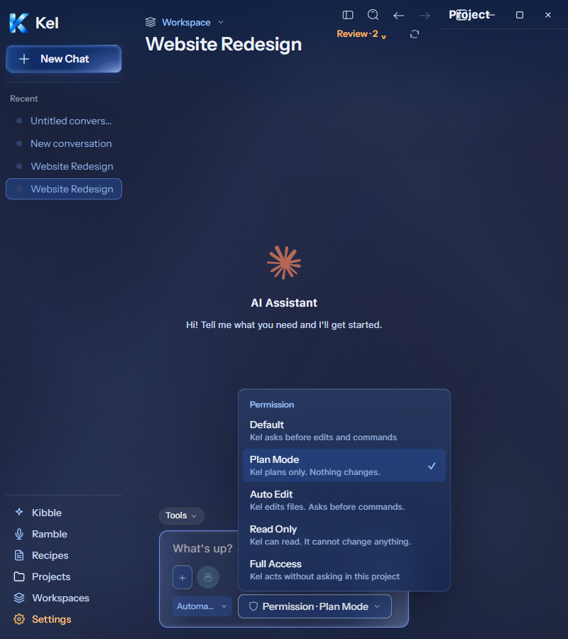
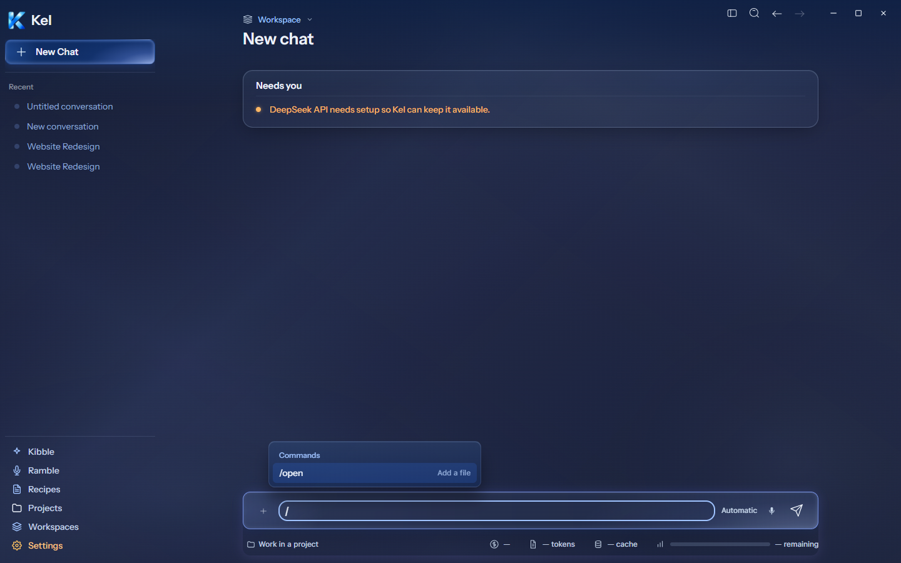
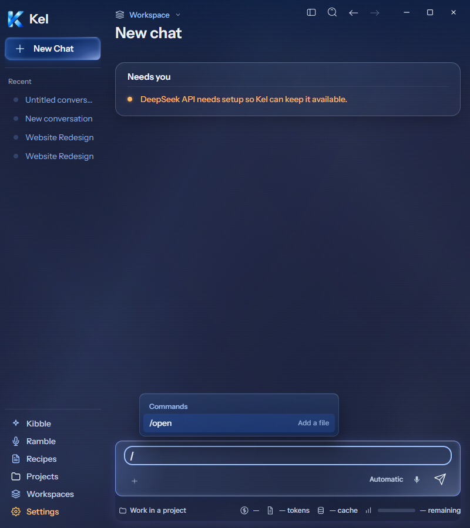
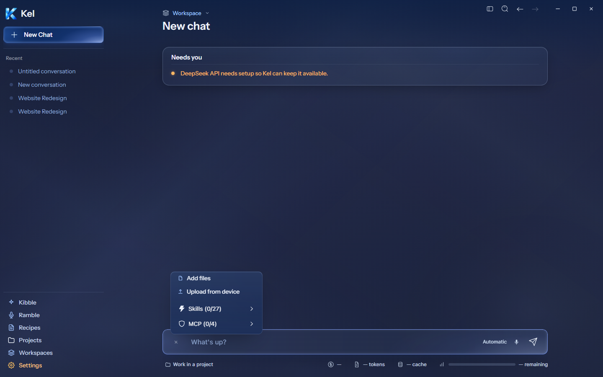
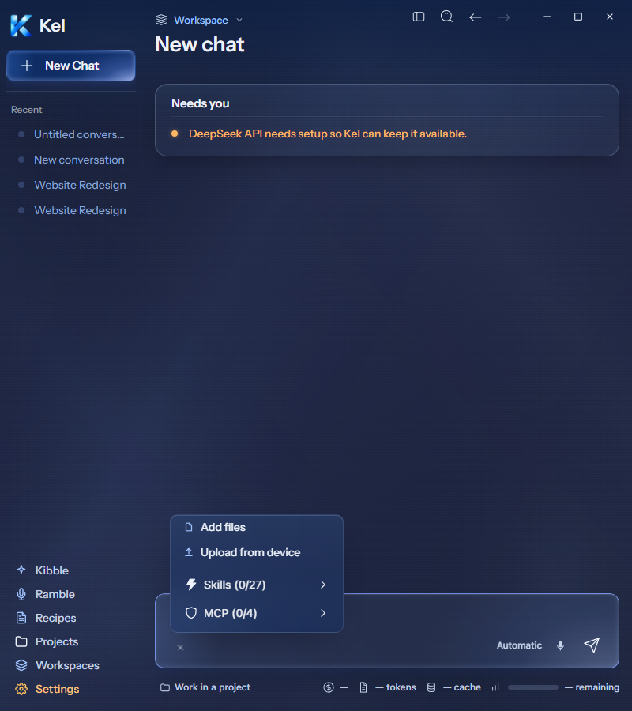

# Desktop Memory, Permission, Slash, and Attach menus

Current Figma frames: [Memory review `273:8389`](https://www.figma.com/design/BlpVvZGuc9j9HhxUojIiJI/Kel-Design-System?node-id=273-8389), [Permission menu `273:9098`](https://www.figma.com/design/BlpVvZGuc9j9HhxUojIiJI/Kel-Design-System?node-id=273-9098), [Slash menu `273:9737`](https://www.figma.com/design/BlpVvZGuc9j9HhxUojIiJI/Kel-Design-System?node-id=273-9737), and [Attach menu `273:9951`](https://www.figma.com/design/BlpVvZGuc9j9HhxUojIiJI/Kel-Design-System?node-id=273-9951). Component metadata and design context were read directly for Memory `273:8567` and Permission `273:9273`.

## Source render checks — 2026-09-26

The isolated Electron shell loaded the canonical renderer development server. These captures prove current source rendering, not current package contents. Nick chose larger desktop milestones for packaging. This batch awaits that milestone package. Canonical App still packages `8c67121`; the disposable shell packages `98387fc`.

Memory review measures 440×236 at 1440px and 800px. It uses 16px/18px padding, 14px radius, 15px labels, 16px values, and 34px actions. The review pill sits in the desktop chat header. The actual queue count appears beside the heading. Review details opens without deciding; Not now keeps the existing defer action. The desktop action order is Review details, Not now, Reject, Accept.

Permission measures 300×286 with five supplied options at both widths. Its 27px heading and 47px rows match component metadata. Descriptions remain visible, with the selected or pending marker on the right. The menu only lists runtime-supplied modes. Five options were injected for this presentation check; this does not prove their availability in a live provider. The supplied Auto Edit label now matches Figma in desktop source checks at both widths.

All four menus use the full neutral 14% border, blue glass gradient over `rgba(15,45,100,.4)`, and 24px blur. No colored accent rail was added. Slash and Attach use 10px radius. Slash is 340px wide and opens above the composer. Actual skill commands receive a Skills heading. The isolated catalog only exposed `/open`; `/btw` and `/xlsx` were not invented. Its desktop description now matches Figma's “Add a file”. Attach is 220px wide and retains actual Skills and MCP controls alongside both file actions. Those extra controls make the captured menu taller than Figma's two-row example.

At both widths, all four menus have zero document overflow, zero internal horizontal overflow, and no clipped screen bounds. No renderer errors occurred. Escape and slash keyboard selection passed. Review details opened and closed; defer was intercepted before any memory mutation. Add files reached an injected canceled native dialog. The full underlying chat is not a pixel-parity claim.

TypeScript, source build, and nine focused tests passed across two files. Tests cover supplied modes, local mode selection, review-only behavior, busy action blocking, both file paths, and uploaded file delivery without a chat turn. Canonical App and durable Data were untouched. Mobile remains paused. The isolated test app and bounded renderer server closed after checks. Previously policy-blocked temporary fixtures remain.

