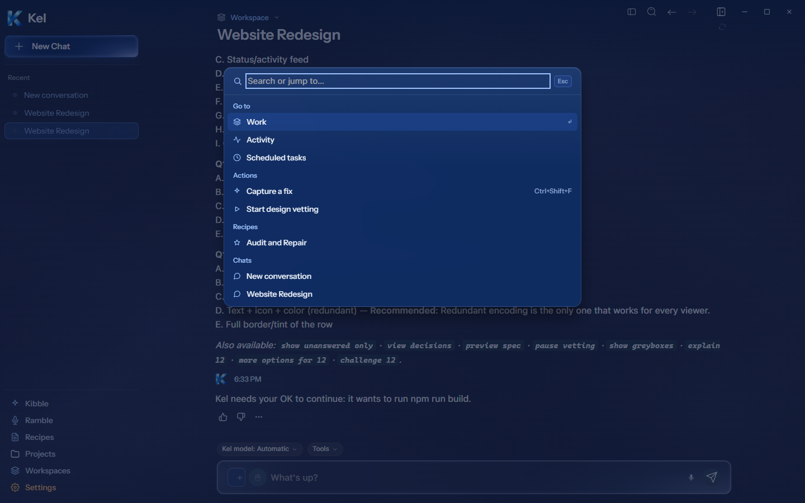
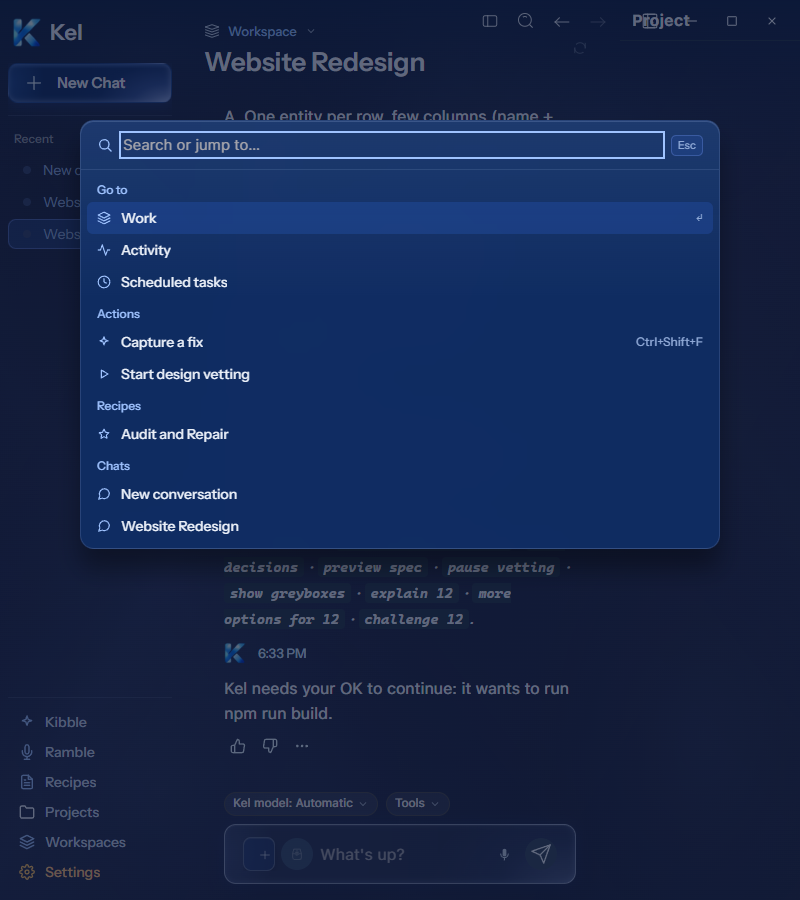
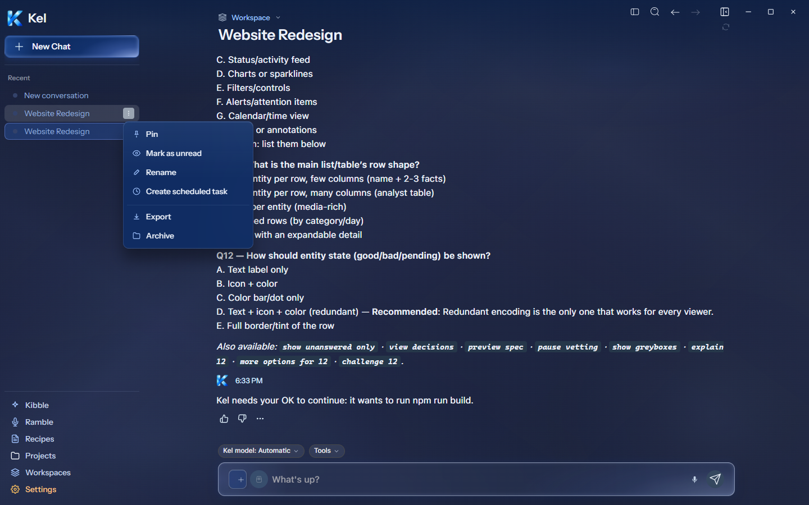
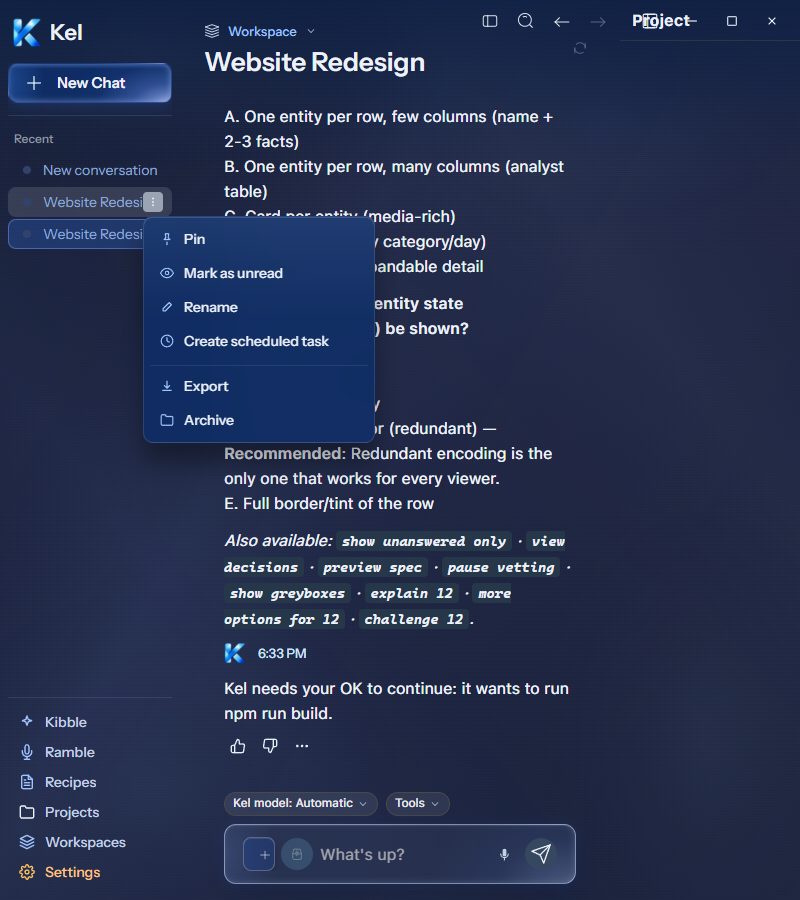
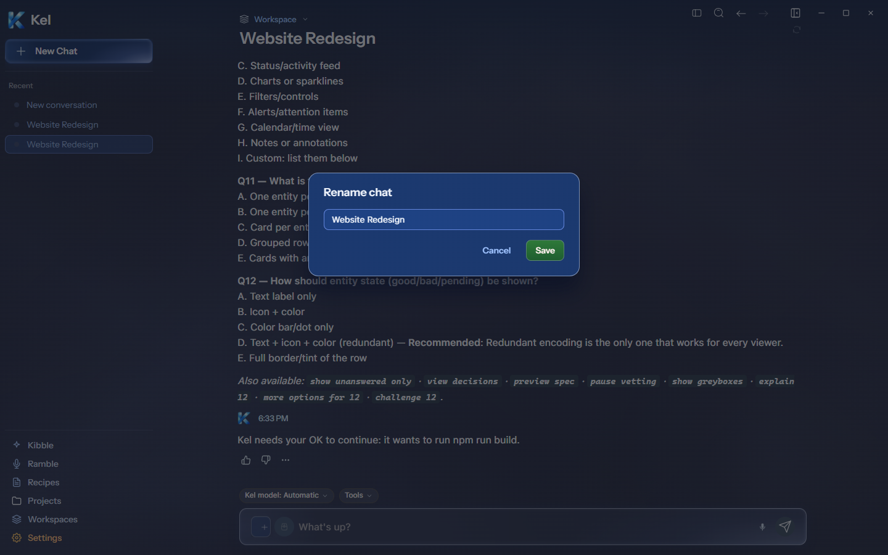
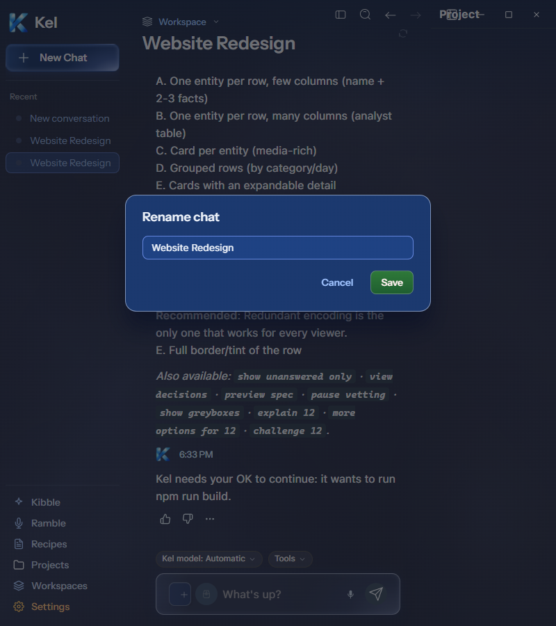

# Desktop command palette and chat overlays — current Figma

The current [Command palette `273:595`](https://www.figma.com/design/BlpVvZGuc9j9HhxUojIiJI/Kel-Design-System?node-id=273-595), [Chat row menu `273:8648`](https://www.figma.com/design/BlpVvZGuc9j9HhxUojIiJI/Kel-Design-System?node-id=273-8648), and [Rename chat `273:8854`](https://www.figma.com/design/BlpVvZGuc9j9HhxUojIiJI/Kel-Design-System?node-id=273-8854) were read directly and implemented as one desktop batch.

The disposable Windows package measured the palette at 640×429, x400/y120 at 1440px and x80/y120 at 800px. Its navigation, action, recipe, and chat groups use actual data. The real Capture a fix action opened selection and Escape canceled without saving. The palette retains focus when the composer mounts and Escape closes it.

The chat menu measured 232×227 with all six real actions, 32px rows, a full divider, 10px radius, and 24px blur. It opens beside the sidebar row and stays inside both widths. Chat Export uses the existing full-history loader. A renderer download probe captured `Website Redesign.md` and its synthetic user/assistant messages; it intercepted the final anchor click. Native save-dialog completion was not tested.

Rename measured x500/y280, 440×168 at 1440px and x180/y280 at 800px. Its blue surface, full border, 16px radius, field padding, and green Save button match the current frame. The dialog was canceled; no chat name changed. Figma icons are local assets with their original 14px/16px geometry. Sample chat and recipe names differ from Figma because the package uses actual isolated fixture data.

TypeScript, 37 focused tests, the full desktop suite (54 files / 402 tests), Electron Vite, and Windows packaging passed. Both widths had zero document overflow and renderer errors. Package images below contain no style injection. A final inherited palette-input focus ring was removed afterward and checked with source CSS at both widths (zero outline and shadow). Its packaged confirmation is carried into the next Fix Capture batch. Canonical App and Data were untouched; installed App still packages `8c67121`.

