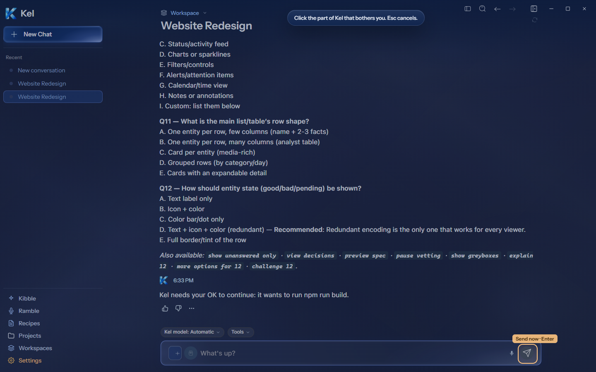
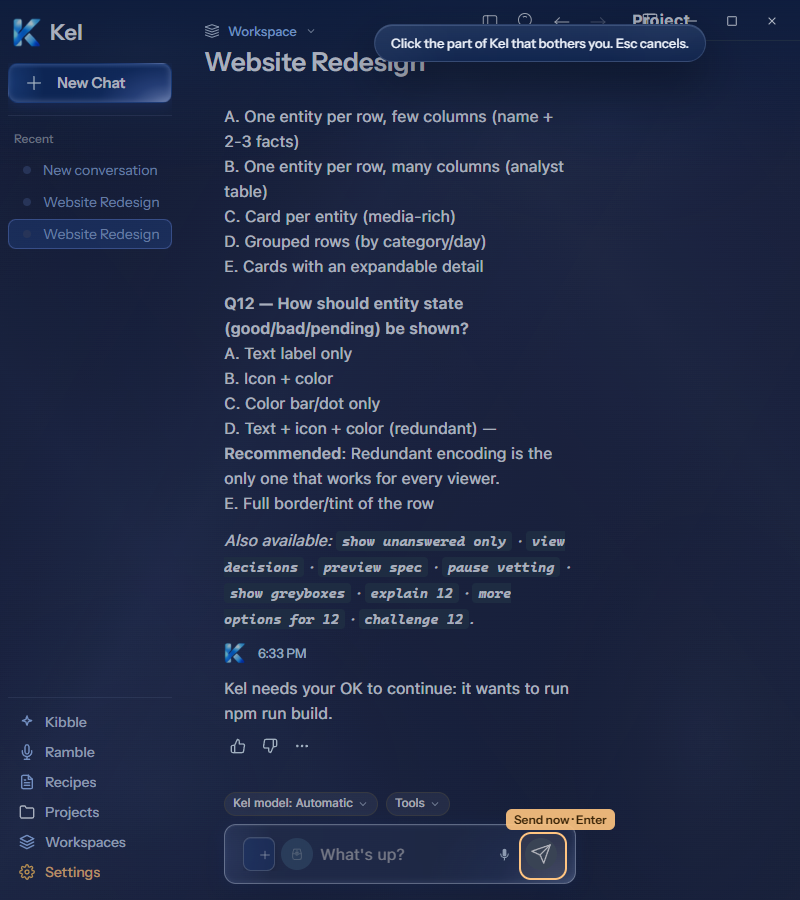
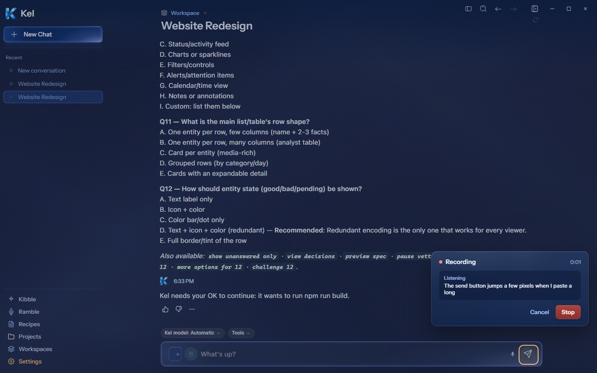
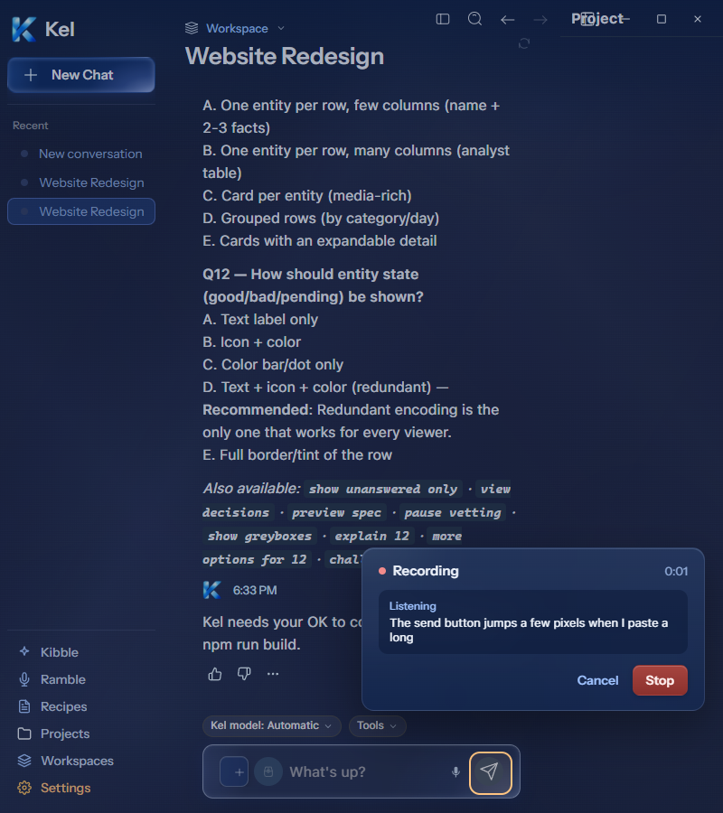
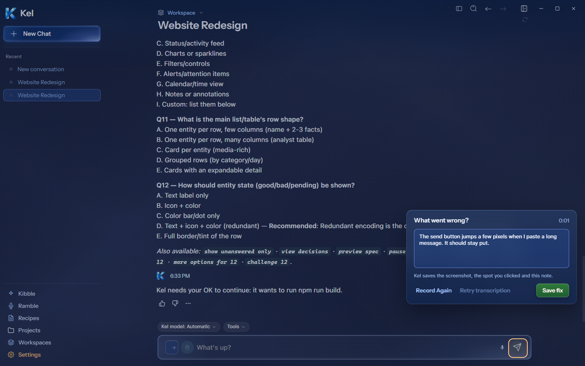
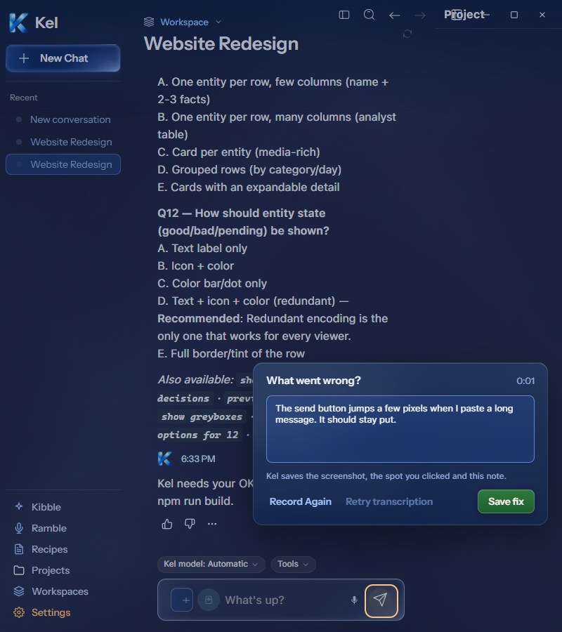

# Desktop Fix Capture — current Figma

The current [Select `273:906`](https://www.figma.com/design/BlpVvZGuc9j9HhxUojIiJI/Kel-Design-System?node-id=273-906), [Recording `273:1091`](https://www.figma.com/design/BlpVvZGuc9j9HhxUojIiJI/Kel-Design-System?node-id=273-1091), and [Review `273:1338`](https://www.figma.com/design/BlpVvZGuc9j9HhxUojIiJI/Kel-Design-System?node-id=273-1338) were read directly. Their three desktop states were implemented together.

The isolated Windows package measured Recording at **380×181px** and Review at **420×232px**, matching Figma's component bounds. Both use a 14px radius, 16px/18px padding, 12px gaps, the blue glass gradient, a full `rgba(191,216,255,.14)` border, and 24px blur. The review field measures 382×96px with an 8px radius and the specified blue fill and outline. Stop uses the red gradient; Save fix uses the green gradient. The original 8×8px Figma recording dot is a local asset and renders at 8×8px.

Select uses the specified scrim, amber full border, 12px target radius, and warm target label. Nested icons resolve to their actual control. The target stays visible through recording and review. The hint stays on one line at 1440px and 800px. Underlying hover tooltips stay hidden during capture and return after cancellation. Panel position follows the selected control. The fixture's composer sits lower than Figma, so its panels sit lower too. A placement regression reproduces Figma's x1040/y560 and x1000/y470 positions for the reference target.

Synthetic audio and intercepted transcription responses drove the real capture hook and reducer. Recording, Stop, typed review, Record Again, empty transcription, retry using the captured audio, and Escape cancellation passed. Retry transcription stays visible but disabled after success or when no failed recording exists. The screenshot capture/discard path used the real isolated bridge. No fix was saved. All five test audio tracks ended, the screenshot temp folder was empty, and the app closed. This is injected audio/transcription proof, not a real microphone or Muse acceptance run.

The package also confirmed the command-palette focus-ring repair at both widths: zero outline and shadow. An asynchronously delayed search fixture rendered without another keystroke, confirming the missing search-result dependency repair.

TypeScript, 48 focused tests, the full desktop suite (54 files / 403 tests), the source build, and Windows packaging passed. The focused capture tests passed again after the final hint/tooltip repair. Both package widths had zero document overflow, panel overflow, and renderer errors. Final captures use packaged source without style injection. Canonical App and Data were untouched; installed App still packages `8c67121`.

