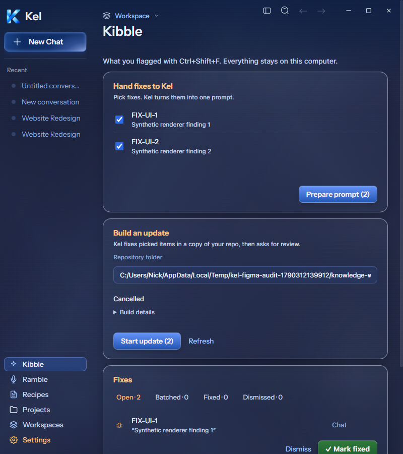
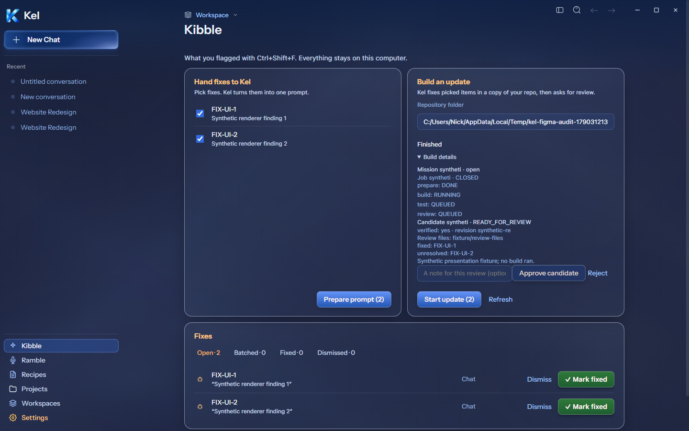
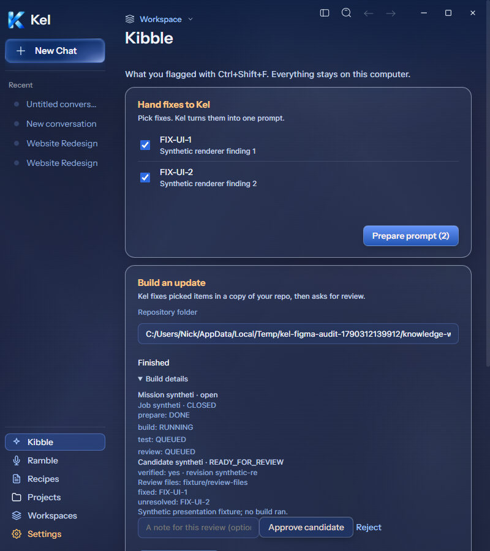
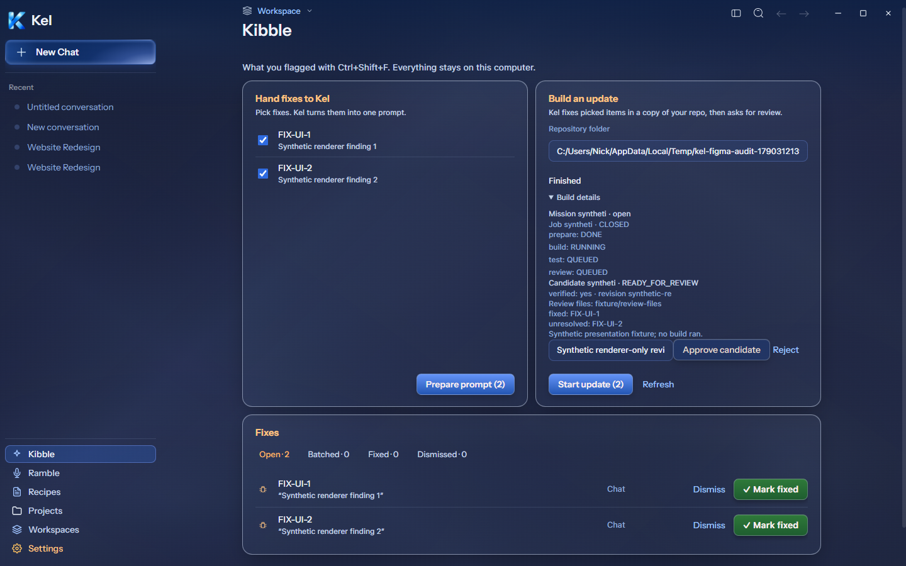
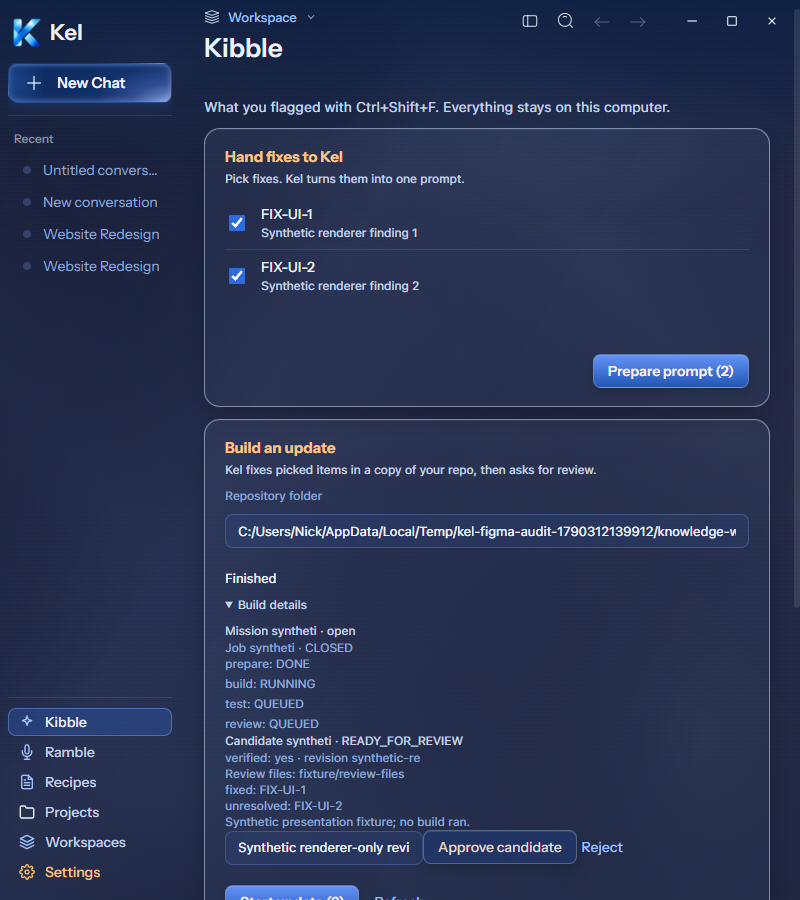
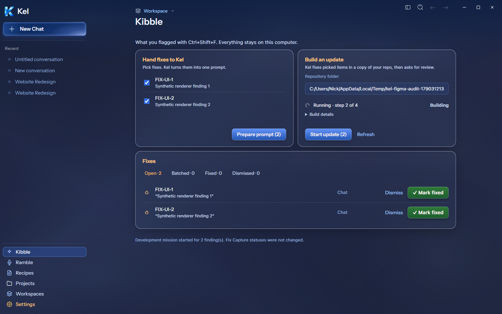

# Desktop Kibble build variants — 2026-09-26

The compact build summary follows current Figma `272:1087`. It uses reported job state and milestones: Running · step 2 of 4 comes from the second reported running milestone, not the first completed milestone. Missing milestone data never invents a count. Cancelled, Stopping, user/model waits, and Finished remain distinct. Only a running job shows the Building label and loader; reduced motion stops loader animation.

Running details are expandable instead of filling the top panel with raw mission/milestone rows. Candidate evidence and review controls open automatically when a candidate exists. Mission/job IDs, verification, revision, artifact path, fixed/unresolved findings, limitations, and review notes remain accessible. The short panel copy explains isolated repository work; expanded/screen-reader information preserves the fuller behavior. Candidate approval/rejection still records a review and installs nothing. Mobile retains its previous summary-free, open details and controls.

At 1440px and 800px, Running, ready-for-review approval/rejection fixtures, and Cancelled passed source checks with zero horizontal overflow or renderer errors. Expand/collapse and reduced-motion checks passed. Approve and Reject passed existing request handoff checks and displayed their reviewed states. The two candidate IDs were distinct.

All dogfood records/build operations in this probe were injected/intercepted in the disposable app's IPC handler. No actual mission, worker, filesystem build, candidate review, installation, or user finding mutation occurred. This is presentation/handoff proof. The earlier real isolated fix selection/status/prompt checks remain separate evidence. Running/candidate execution, mission recovery after navigation/reload, and packaged proof remain open. Candidate review has no exact populated current Figma frame; it follows current components while retaining actual evidence.

TypeScript, final source build, seven focused tests, and the full desktop suite (63 files / 437 tests) passed. Canonical App remains `8c67121`; disposable package remains `0b4a583`. Data was untouched. Mobile remains paused.

