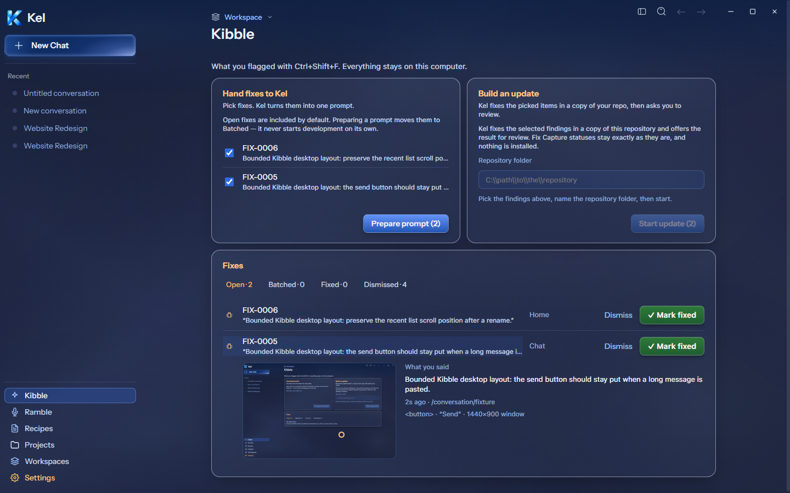
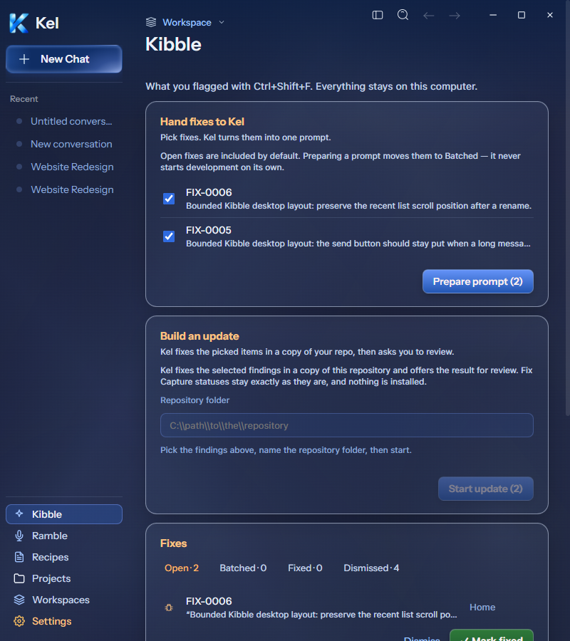

# Desktop Kibble current revision — 2026-09-26

Authority: current Figma frame `272:1087`. Desktop now has the Workspace link, separate introduction, two top panels, selected findings with two-line copy, footer prompt/build actions, Fixes card/count tabs, direct Dismiss/Mark fixed/Reopen actions, and screenshot/quote details. Fields measure 34px, screenshots 280px wide, card radius 16px, full glass outline, and 12px panel gap. Warm labels and green Mark fixed use the current design system. Active tabs use text color; no single-side accent border was added.

At 1440px the panel bounds are x385/y142, 454px wide, with a 12px gap. They are 302px high because truthful prompt/build behavior remains visible. Figma's sample top row is 279px high. At 800px panels stack and row actions wrap; page overflow and renderer errors are zero. There is no exact current narrow Kibble frame. Live mission/candidate evidence may grow the build panel. No full-frame exact parity is claimed.

Two fresh synthetic findings were saved through the real isolated engine; one used an actual temporary app screenshot. Mark fixed and Reopen persisted. Preparing a prompt included only the selected new findings and moved them to Batched. Both were then dismissed by exact IDs. The small prompt, dismissed findings, and screenshot remain only in the reused bounded temporary store. Existing findings were not changed.

Start update availability was checked with the selected findings and a bounded source path. It was not clicked. Running build/candidate review presentation and execution remain open; no mission touched the canonical repo and nothing was installed. Existing candidate approval/rejection, evidence, artifact paths, and status semantics remain. The initial failure view now follows all hooks, repairing recovery that previously changed hook order. Mobile retains its existing controls and layout wrappers use display contents.

TypeScript and source build passed. Two focused files / 35 tests passed, including three meaningful Kibble regressions: selected prompt/no build, direct status/Reopen, and failed-load recovery. The final desktop suite passed 61 files / 431 tests. The disposable packaged app remains source `0b4a583`; this Kibble batch awaits the next larger milestone package. Canonical App stays `8c67121`; durable Data was untouched.

