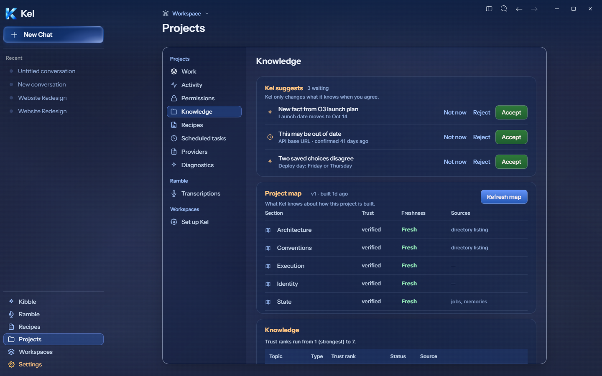
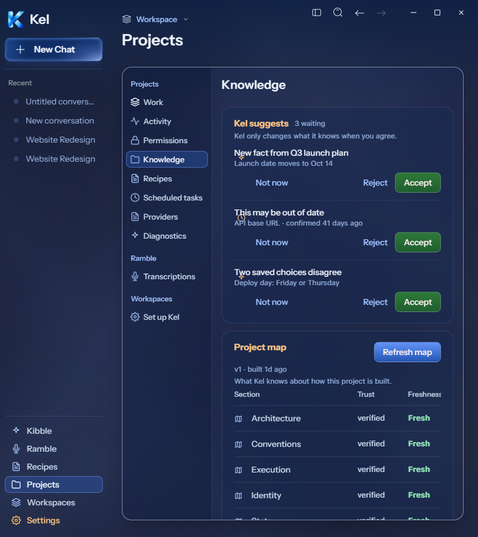
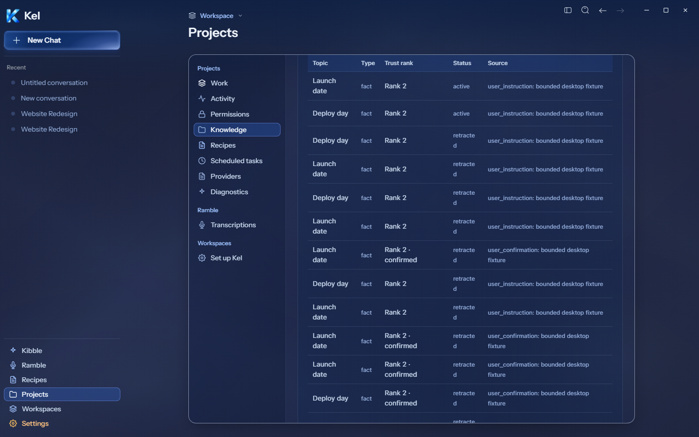
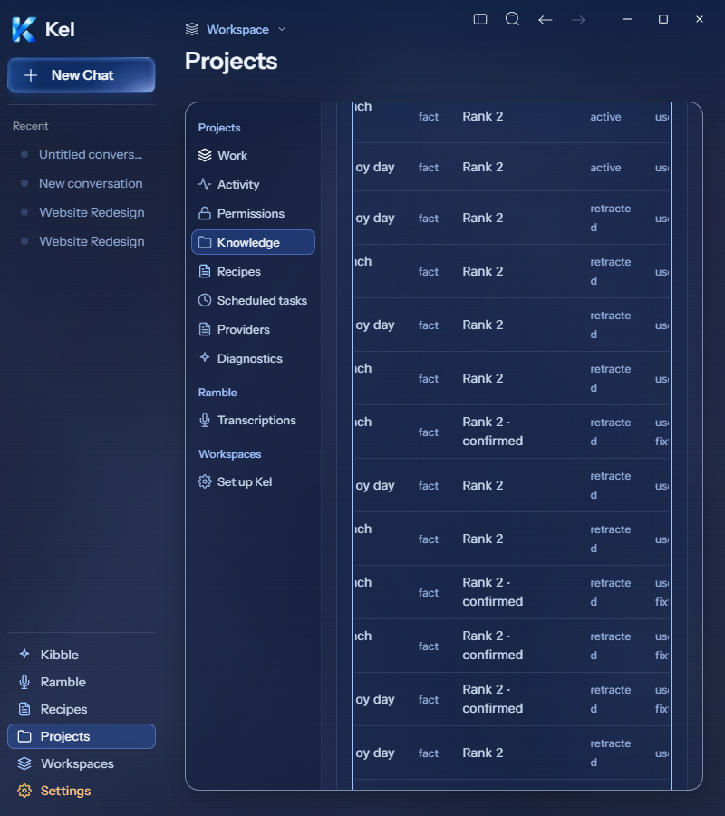
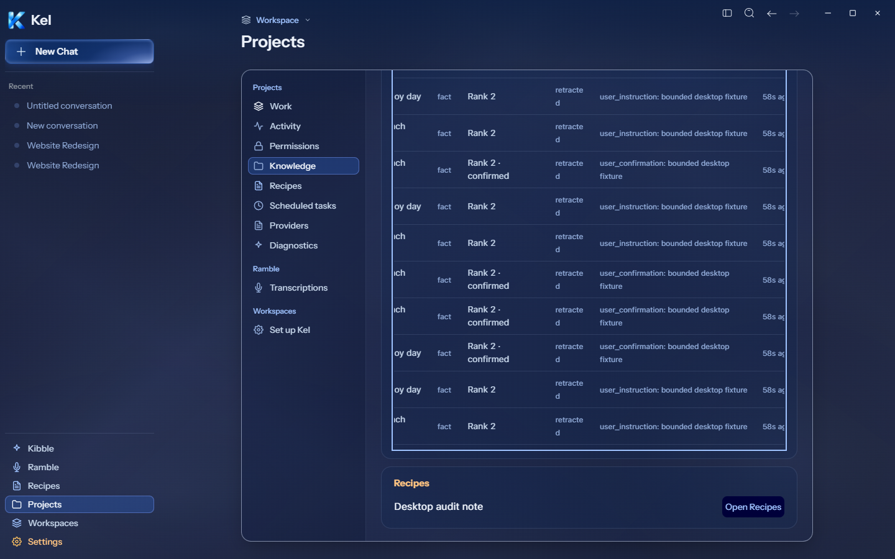
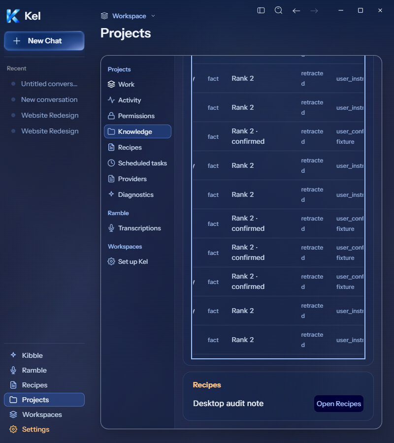

# Desktop Knowledge and project recipes

## Current source acceptance — 2026-09-26

Live Figma [Knowledge `271:247`](https://www.figma.com/design/BlpVvZGuc9j9HhxUojIiJI/Kel-Design-System?node-id=271-247) supplies three proposals and a four-section sample map. Its layout now drives the desktop Knowledge route. The proposal panel measures x613/y183, 670×240 at 1440px. Its row icons, Not now / Reject / Accept order, green Accept, copy, border, radius, and spacing follow that frame. Clock and sparkle SVGs came from the frame. At 800px each row moves its actions below its text, keeping the icon beside the text. No accent rail was added.

The fixture used the existing isolated engine and data root. Memory.record/propose_change, ProjectMap.refresh, and RecipeLibrary.save produced durable records through authoritative engine methods. No renderer response was fabricated. Three proposals used synthetic values and provenance. The engine keeps their newest-first order, rather than hard-coding Figma sample order.

The real engine supplies five deterministic map sections and Verified trust, not Figma's four illustrative sections and numeric scores. Its freshness, sources, version, and retained build time remain truthful. Digest hashes no longer occupy a primary map column. The map table scrolls inside its card at 800px. Refresh map passed against the actual isolated engine.

Saved records retain source, type, status, updated time, and actions in a named keyboard-scrollable region. The engine uses ranks 1–7, with 1 strongest. Desktop now shows that rank and explanation, rather than inventing a score out of ten. Confirm is unavailable for inactive or external records; Retract is unavailable outside active/stale states. Forget remains available through the existing route. Historical and forgotten synthetic rows remain visible; no exact Figma match is claimed for this extra table.

Real desktop clicks accepted, deferred, and rejected proposals; confirmed, retracted, and forgot records; refreshed the map; and opened the saved project recipe in Recipes. No recipe was run and no provider was called. The project recipe card now lists actual saved entries with an Open Recipes action. The existing mobile presentation was preserved.

Final source renders pass at 1440/800px with zero document/card overflow and no renderer errors. Saved-record keyboard scrolling passes at both widths. TypeScript and ten focused Work/recipe tests pass. The larger desktop regression passes 60 files / 427 tests. Source build passed; one combined milestone package is pending. This source proof does not describe the older disposable archive. Canonical App remains 8c67121; canonical Data was untouched.

## Cleanup and limits

All fixture proposals were settled; bounded fixture memory content was forgotten through the engine. Content-free history, the unrun synthetic recipe, and the receipt stay within the reused temporary root. No new permanent data root, candidate, branch, or worktree exists. The required request_review tool is unavailable; review and checks were performed locally, with no independent approval claimed. Earlier policy-blocked temporary fixtures and the generated root-level packages/ cache remain; removal was not retried.

