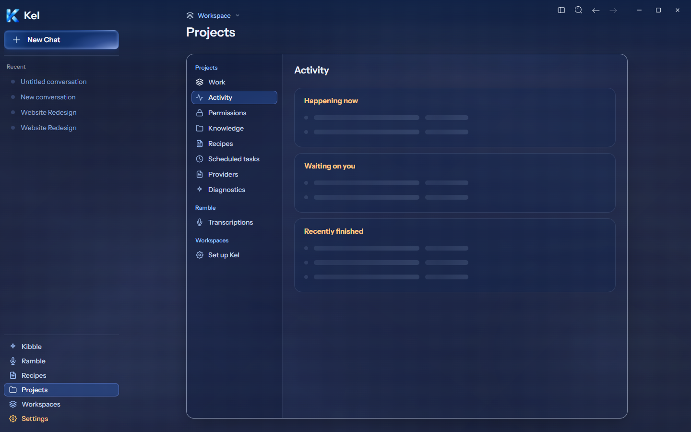
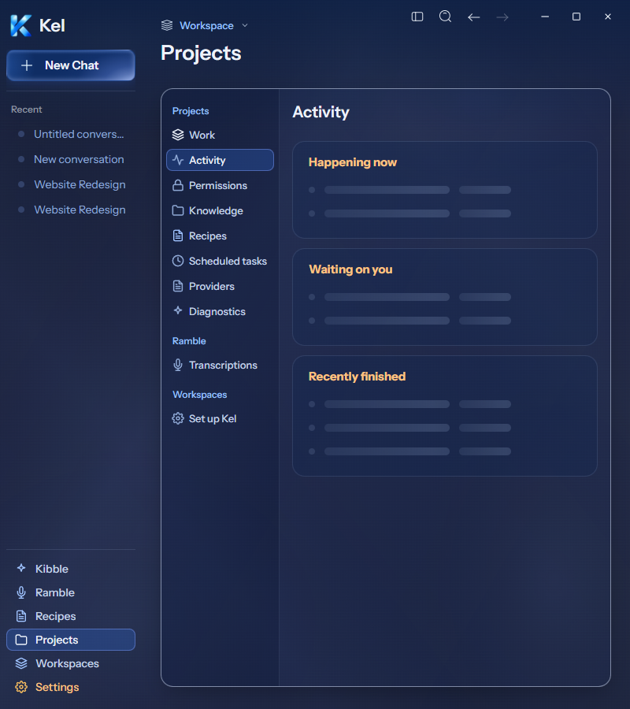
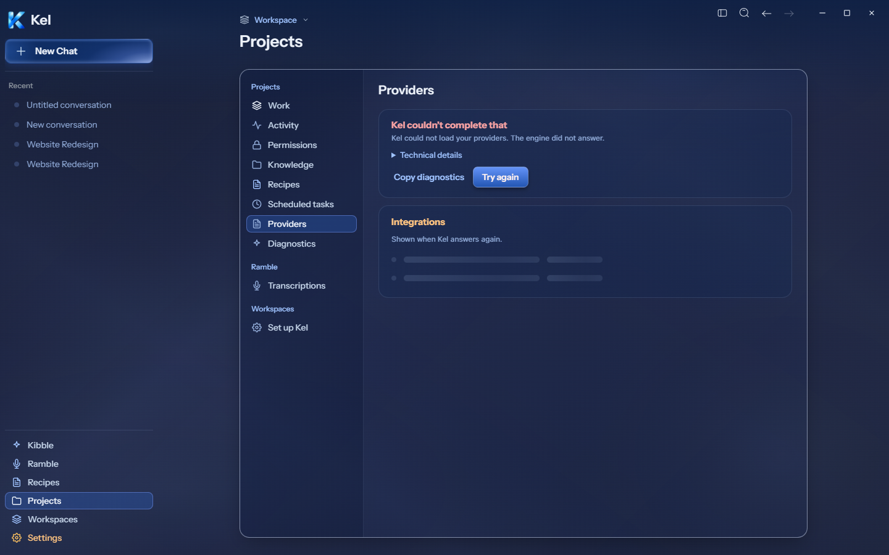
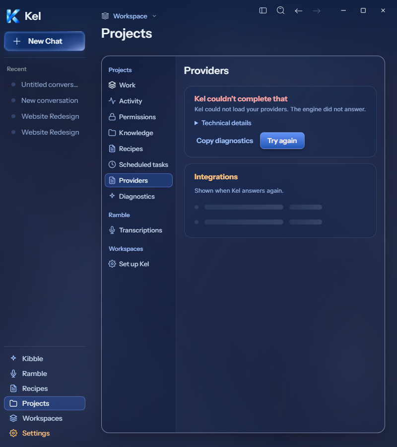

# Desktop Activity loading and Providers error

Current Figma frames [Activity loading `273:12291`](https://www.figma.com/design/BlpVvZGuc9j9HhxUojIiJI/Kel-Design-System?node-id=273-12291) and [Providers error `273:12486`](https://www.figma.com/design/BlpVvZGuc9j9HhxUojIiJI/Kel-Design-System?node-id=273-12486) were read directly.

## Package checks — 2026-09-26

Package source: `98387fc0f2b24b92e934d8c9c13277da502e7a00`. All 265 archived renderer files match the frozen source build. Archive SHA-256: `7010d4b41f4d16d7415b38d8dea6f415d26b0a17d712968f7b92f145924de532`.

Activity retains its heading while waiting. Three cards contain 2, 2, and 3 skeleton rows. Rows measure 30px. The sweep lasts 1.4 seconds and stops under reduced motion. Cards use 16px/20px padding, 16px radius, a full neutral 12% border, blue 6% fill, and the dark 22% layer. The empty result replaces the loading state; no empty-state message appears while waiting.

Providers error uses the same card treatment and fills the available content width. The heading uses `#f9a3a3`; body text uses `#8fa9d6`. Copy diagnostics precedes the 34px Try again button. The quiet action has no dark backdrop filter. Technical details use the actual error and isolated engine diagnostics. Figma's sample PID and heartbeat are not invented. Integrations shows two skeleton rows; readiness and credential sections stay hidden during desktop failure.

An injected desktop bridge hold and rejection exercise these states. This proves presentation, not a live engine outage. Retry disables while pending. Releasing it calls the real isolated engine catalog and removes the failure. Copy diagnostics completes and its clipboard content contains the actual error. Both widths, 1440px and 800px, show zero document and card overflow. No renderer errors occurred. The native titlebar and actual isolated sidebar content differ from Figma's example shell.

TypeScript, source build, and Windows package passed. Focused state tests passed 29 tests across four files. The full desktop suite passed 417 tests across 58 files. Canonical App still contains source `8c67121`; App promotion follows desktop completion. Durable Data was untouched. Mobile remains paused.

The test app closed. No permanent candidate or data root was created. Previously policy-blocked Workspace and `work-appearance` fixtures remain in the existing temporary stack.

