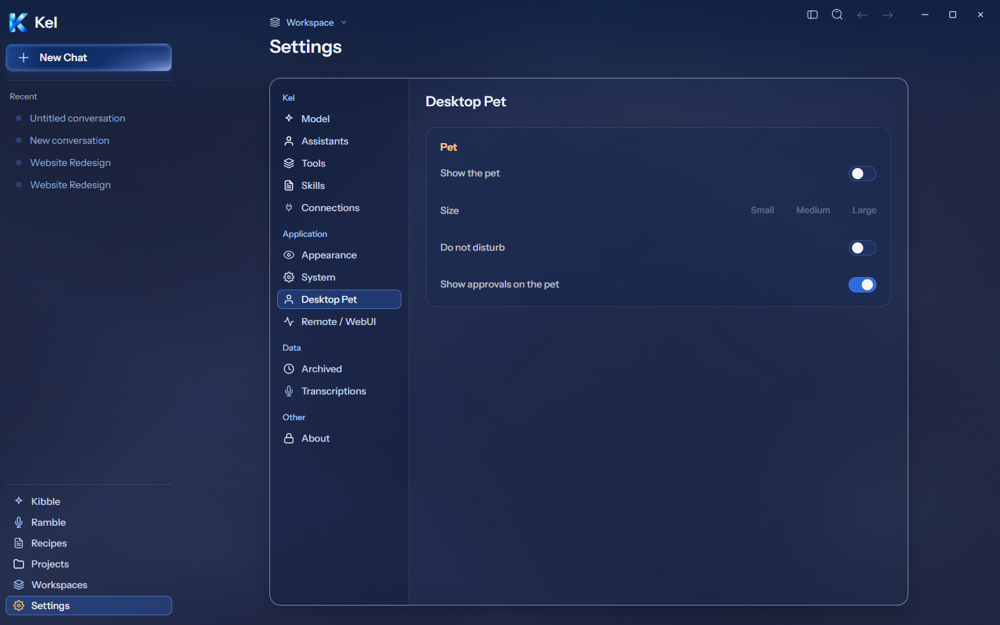
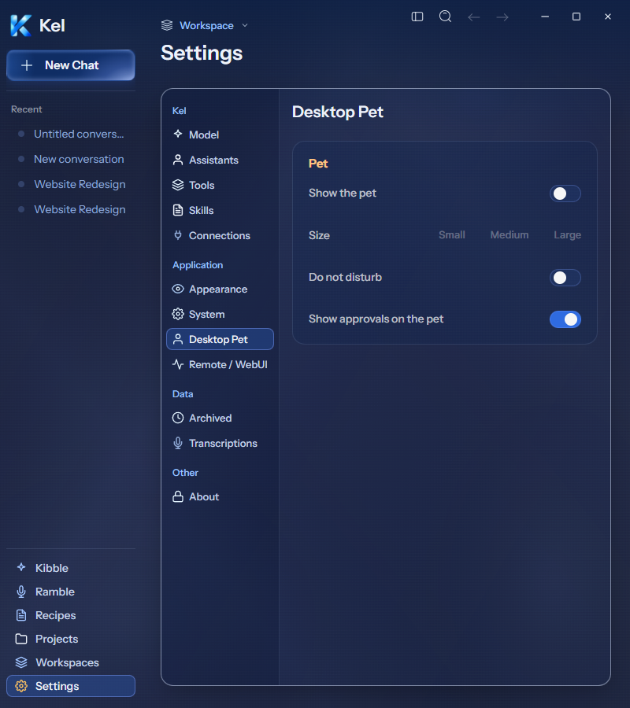
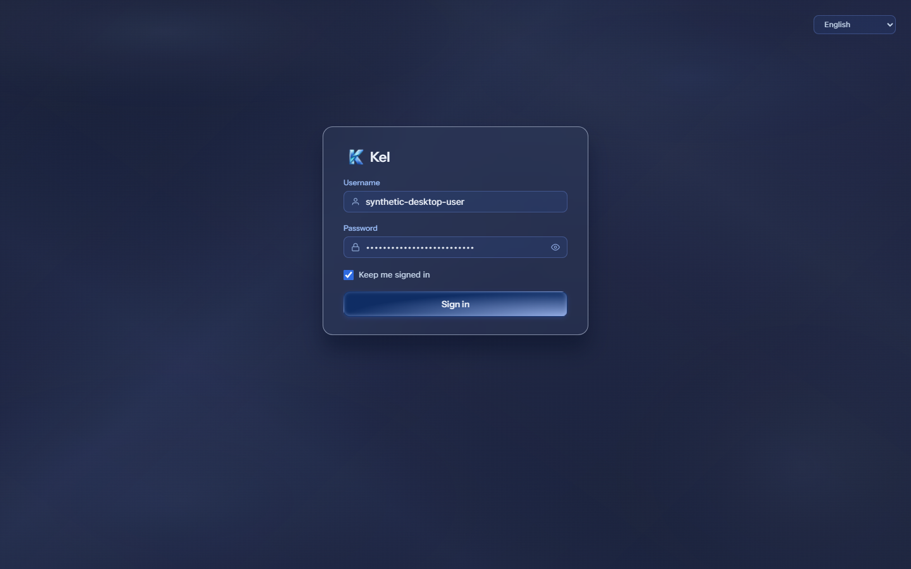
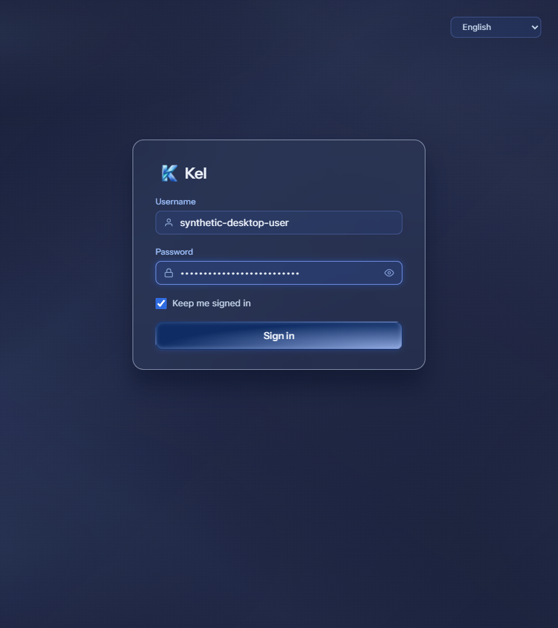

# Desktop Pet and remote sign-in current revision — 2026-09-26

Authority: Desktop Pet `314:5271` and remote sign-in `272:7932`. These are source-render checks; neither screen is claimed packaged at this source.

## Pet off/settings

Desktop inner title is Pet. Labels are Show the pet, Size, Small/Medium/Large, Do not disturb, and Show approvals on the pet. Switches have accessible names. Rows use current fonts, spacing, neutral separators, warm selected text, and the subtle two-layer panel fill. No single-side accent border or underline was added. At 1440px the panel measures 670×259 at x613/y183. At 800px it measures 388×259 at x371/y179. Both have zero page overflow and renderer errors.

Actual isolated IPC reports Off. Dependent size/DND/approval controls remain disabled. Clicking enable hit the real existing policy refusal, displayed its reason, and reconciled back to Off. Reload stayed Off. No policy constant changed and no pet process became active. Figma's enabled sample remains unaccepted until Nick resolves AUD-MINOR-008. Mobile labels and the phone size selector retain their prior behavior.

## Remote sign-in

The desktop card measures 420×330, centered at y200 at both widths. It has a 16px radius, full glass outline, 24px blur, current canvas, 30×31 Kel mark, plain light title, 34px fields, Keep me signed in, and the blue glass Sign in button. The language control measures 130×30 at top24/right24. Its desktop portal escapes the backdrop-filter card's fixed-position containing block. Mobile retains the existing language placement and labels. Keyboard focus remains visible through a blue field edge/glow and blue control rings. Reduced motion disables decorative motion.

An isolated headless Edge context rendered the source page. Auth/session/settings endpoints and login submission were intercepted. Synthetic username/password input, password show/hide, remember selection, request handoff, and invalid-credential feedback passed. The unsuccessful submission stored no password. No actual credential was read, persisted, submitted to a service, or authenticated. Live remote sign-in/session/deep-link acceptance still requires separate credentials and runtime checks. Existing AuthContext and credential persistence behavior were not rewritten. Light styling has a basic readable fallback; measured Light parity remains open.

TypeScript and final source build passed. All 11 donor-policy tests passed; the complete desktop suite passed 62 files / 433 tests. The final renderer probes passed after presentation refinements. Canonical App remains `8c67121`, disposable package remains `0b4a583`, and Data was untouched. These screens, Kibble, and Setup wait for one later larger milestone package. Mobile remains paused.

