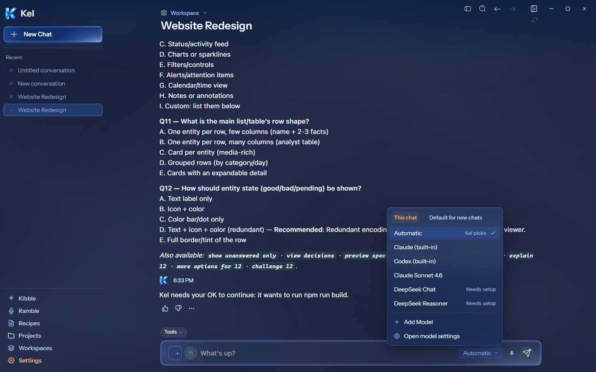
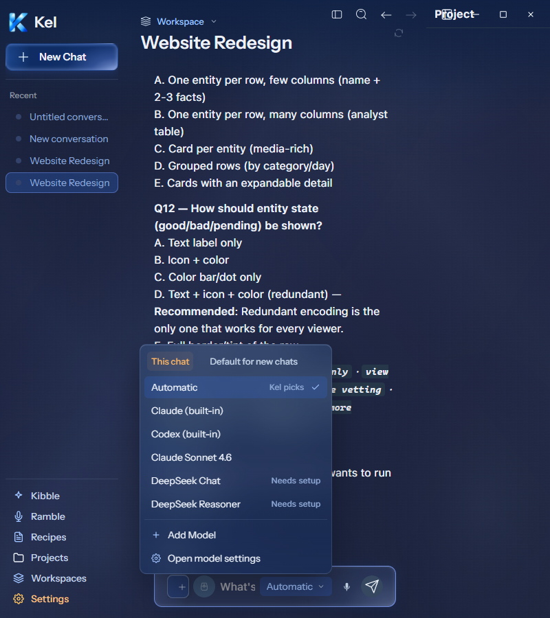
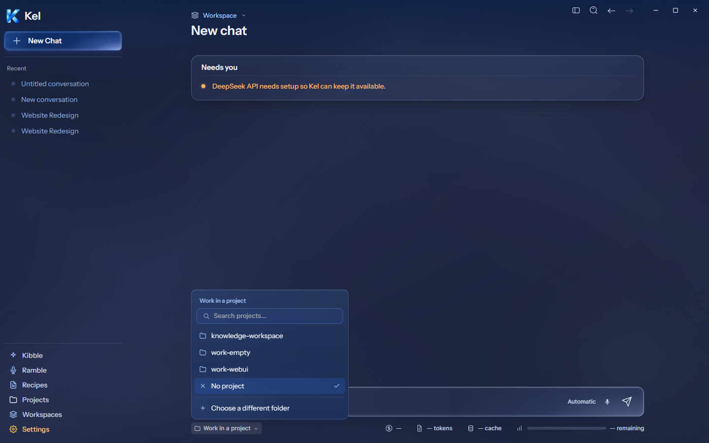
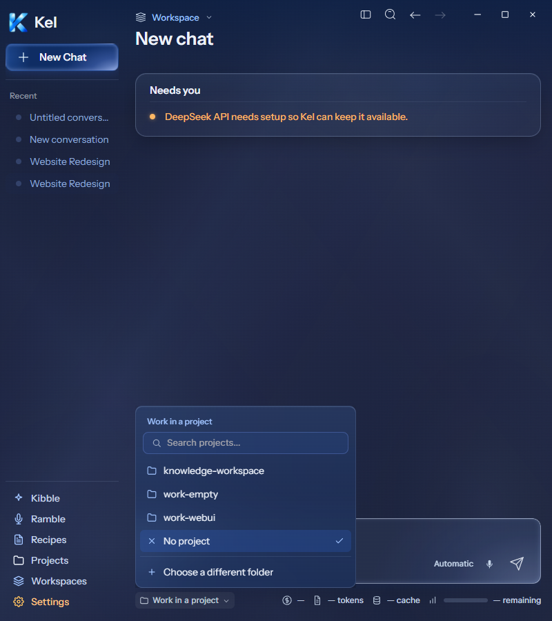

# Desktop Model and Project pickers — current Figma

The current [Model picker `273:9301`](https://www.figma.com/design/BlpVvZGuc9j9HhxUojIiJI/Kel-Design-System?node-id=273-9301) and [Project picker `273:9512`](https://www.figma.com/design/BlpVvZGuc9j9HhxUojIiJI/Kel-Design-System?node-id=273-9512) were read directly and implemented together.

The isolated Windows package checked both at 1440px and 800px. Model is 280px wide; Project is 320px wide. Both use 6px padding, 32px rows, 10px outer radius, the blue glass gradient, a full neutral border, and 24px blur. Original local Figma icons render at their intrinsic 14×14px size. Project search measures 32px high. Model now anchors above the control inside the composer's right side. Project anchors above the footer folder control. Neither picker has document or internal overflow.

The model menu uses the engine's actual catalog and availability. It is taller than Figma's four-choice sample because six choices are present. This chat and Default for new chats save through the existing engine API. A real isolated chat preference changed without changing the default. The default preference also changed correctly. Both original preferences were restored and read back. Add Model opened the existing model form at both widths and was canceled without saving. The tab's warm text and subtle full fill replace Figma's single-side underline to honor Nick's no-accent-rail rule.

Project search filters actual recent folders and includes the selected folder. Selection returns the full path; No project clears it. Escape closes both menus. A simulated native folder-dialog result exercised the existing browse bridge and selected an existing disposable folder. The physical OS dialog was not accepted by hand. No chat or task was submitted, and no real model response was requested.

TypeScript, the source build, Windows packaging, native better-sqlite3 verification, and all 408 desktop tests across 55 files passed. Five focused picker tests cover scope, pending writes, actions, search, deduplication, and full paths. Final captures use packaged source without CSS injection; renderer errors were empty. The isolated app closed. Canonical App still packages `8c67121`; App and durable Data were untouched. Existing chat content and the narrow Workspace header are outside this picker comparison. Workspace is the next desktop batch.

