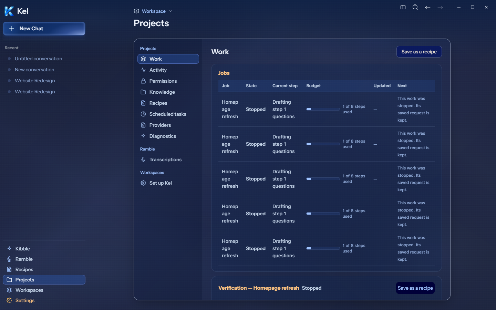
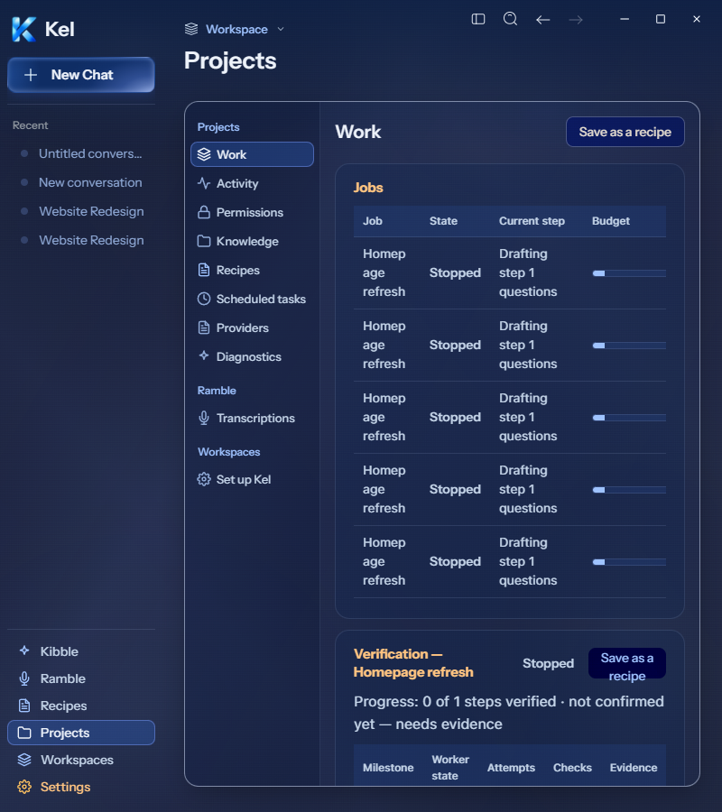
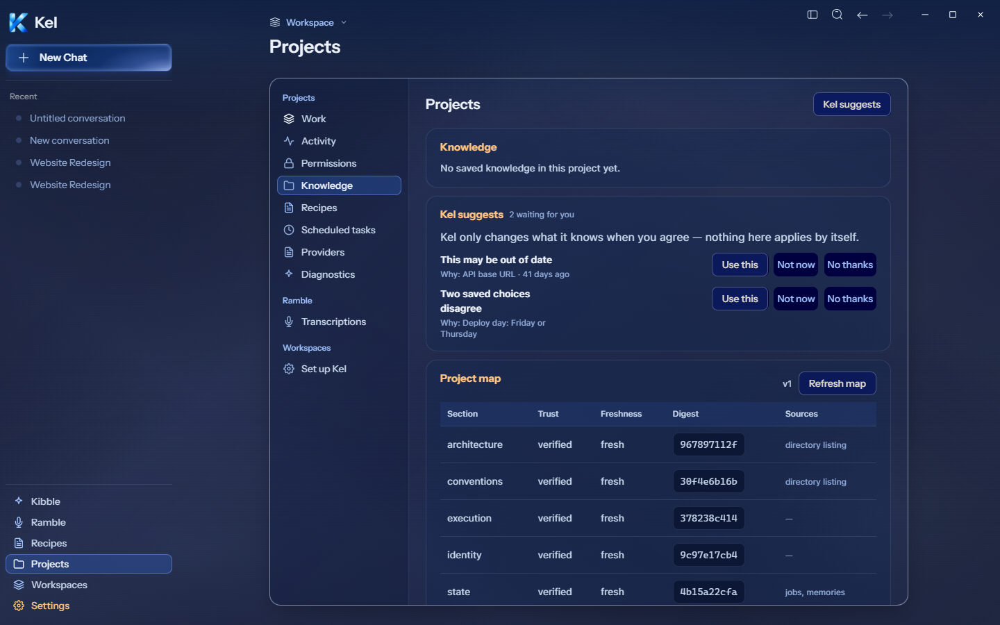
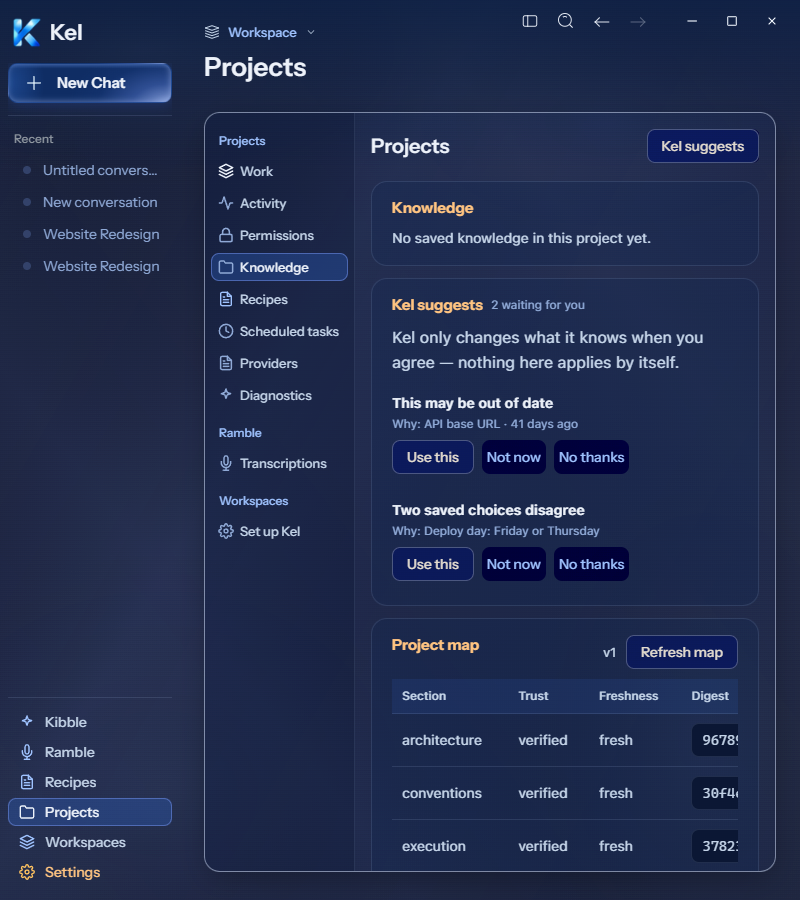

# Desktop populated layout — source checks

## Scope — 2026-09-26

The canonical renderer ran inside the isolated Electron shell at 1440px and 800px. The existing disposable engine supplied five canceled jobs, two knowledge proposals, and five project-map sections. No response was injected for these checks. These are synthetic records from earlier bounded checks, not canonical user data. No work, permission, memory decision, or scheduled task was submitted.

The current Figma Work `189:907`, Permissions `189:1758`, and Projects `189:2193` frames show empty states. These populated captures establish readable runtime layout; they do not establish an exact populated-frame match. Scheduled tasks `189:2628` has earlier populated package evidence. The current disposable host has no scheduled tasks or permissions, so this check does not close their populated acceptance.

At 800px, suggestion buttons previously squeezed the summary and reason into a narrow column. The desktop repair gives text its full row and places buttons beneath it. The two-proposal card now measures 388×328 instead of 388×519. Wider desktop placement remains unchanged.

The six-column Work table previously overflowed its card by 103px at 800px. A named, keyboard-focusable table region now contains horizontal scrolling. Its card has zero horizontal overflow and measures 388×505 instead of 388×1672. The project map uses its existing scroll wrapper with a readable minimum table width at narrow desktop sizes. No desktop font was reduced to make columns fit. Phone styles were unchanged.

Final source checks report zero document and card overflow at both widths, no renderer errors, and successful keyboard scrolling in the Work table. TypeScript and the source build passed. No package was created for this increment, following Nick's larger-milestone packaging choice. App and durable Data were untouched.

Open states: active/waiting Work actions, populated permission leases and requests, saved knowledge rows, project recipes, and the later combined package check. Mobile remains paused.

