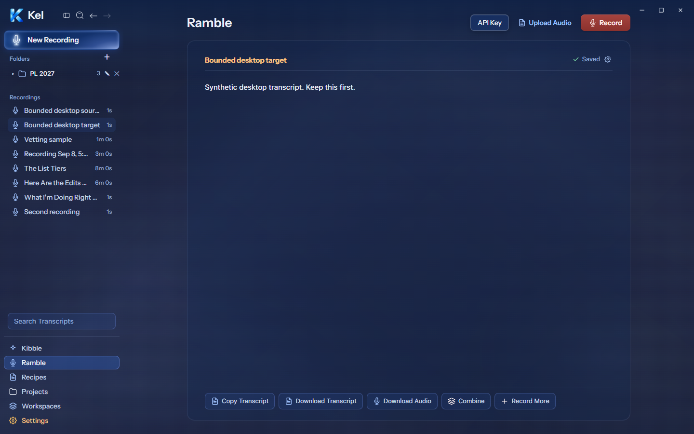
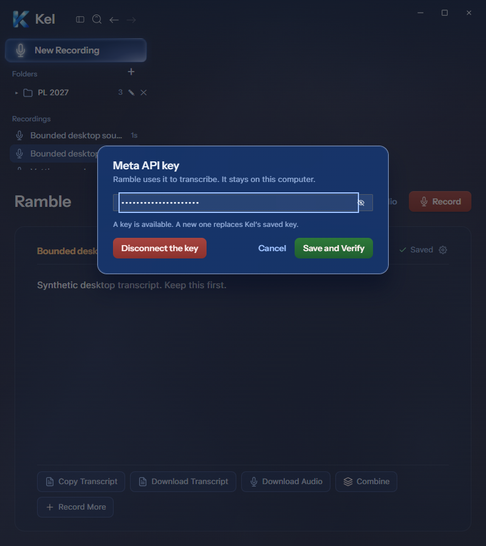
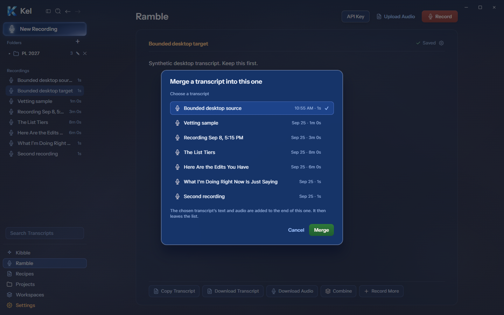
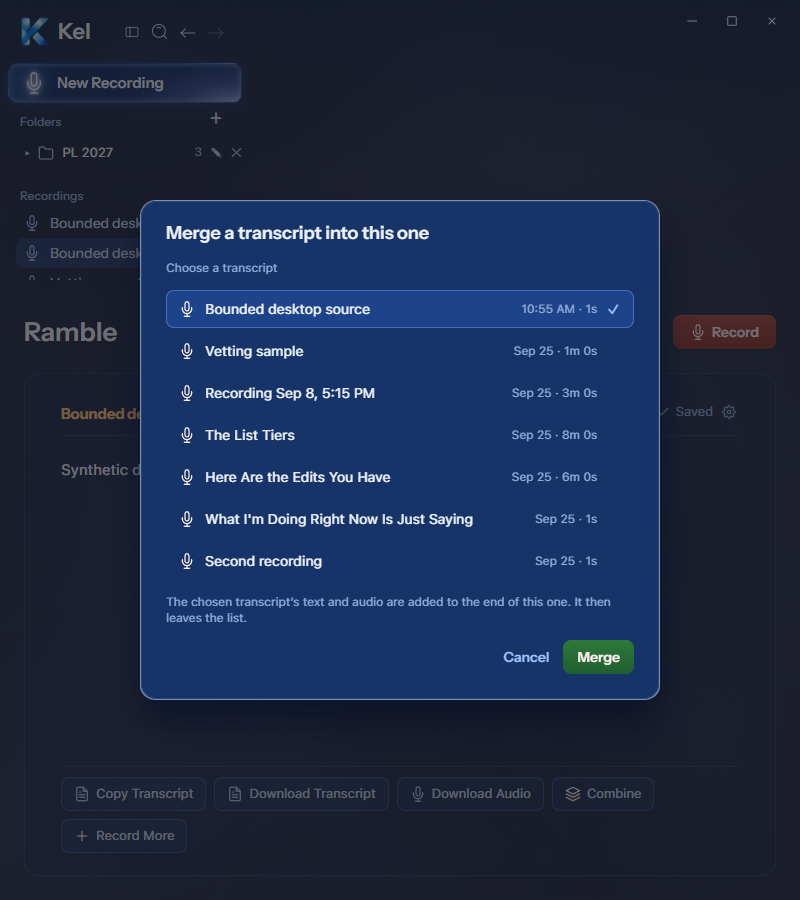

# Desktop Ramble — current revision, 2026-09-26

Fresh Figma Ramble `194:1366`, Meta API key `273:10383`, Merge `273:10599`, and Vetting `273:10837` drove this batch. The current renderer was checked inside the existing isolated packaged shell at 1440px and 800px. Mobile retains its existing dialogs and layout. These source changes await a larger milestone package.

## Transcript and key states

The desktop sidebar now places Search Transcripts above bottom navigation and labels the list Recordings. Microphone icons, transcript title/status alignment, card vertical spacing, and the five compact footer actions follow current Figma. Record More moves to the footer; the embedded Transcriptions library retains its existing controls. At 800px the existing desktop layout stacks and wraps; no exact narrow Figma frame is supplied. Page overflow remained zero.

The Meta key modal measures 480×212 at y240 and is centered at both widths. The key input remains available when a key already exists, enabling replacement of Kel’s locally saved key. Cancel and Escape clear the unsaved draft. A synthetic unsaved value enabled Save and Verify; no key save or disconnect occurred in the app probe. Existing key availability came from the real isolated engine status. No credential value was read or exposed. There is no fabricated key suffix because the engine does not expose one.

The save path now reads back local provider readiness and uses truthful desktop feedback. This checks local setup; it does not authenticate a key against Meta. First live transcription remains separate acceptance. The desktop disconnect message refers only to Kel’s saved key; environment/shared-app fallback credentials remain outside this operation. A new DOM regression proves connected-key replacement input and canceled-draft clearing without a write.

## Merge

The desktop modal now supplies a selectable transcript list instead of a dropdown. It is 520px wide, centered, y200, with dated/duration metadata, selection check, Cancel, and Merge. Arrow-key selection passed. Seven actual isolated rows produced a 500px modal; Figma’s four-row example is shorter. Longer lists scroll within a bounded region. The hint preserves the actual behavior: text/audio append and the source leaves the list.

Two fresh synthetic recordings were created through the real engine. The real Merge action appended the source text and removed its record. The target was then deleted. Both new fixture recordings were cleaned up; older synthetic recordings were preserved. No microphone, upload transcription, provider call, or key mutation occurred.

## Vetting

The desktop modal is 620px wide, centered, y70. Actual engine requirements, concerns, unresolved statements, proposals, confidence flags, and conflict warnings remain visible. It no longer claims no answers when free-think buckets contain statements. Check again, Process batch, and Accept all retain existing authority. A gear menu exposes Rename and Vetting answers on desktop. Row pencil buttons open the existing full-transcript review editor; a distinct per-answer editor is not claimed.

The existing synthetic Vetting sample produced two real buckets and a proposed match. Both widths showed a 347px surface without page/internal overflow. Editing the review text and Check again used the real preview route and added the concern bucket. Escape closed the modal. The saved transcript remained unchanged. Process batch and Accept all were not clicked; no vetting answers were applied. The frame’s third bucket and flagged answer appear only when actual data supplies them.

## Validation and scope

TypeScript and the source build passed. Runtime transcription tests passed 35 cases, including merge and vetting routes. Four transcription-policy tests and four Ramble DOM tests passed. The DOM suite isolates shared-modal theme context instead of performing unrelated persisted-theme IO. The final full desktop suite passed 60 files / 428 tests. Renderer errors were zero across the source probes.

Canonical App still packages `8c67121`; durable Data was untouched. The bounded temporary stack was reused. New fixture recordings were removed, all app probes closed, and no permanent root/worktree/candidate was created. Previously blocked residue removal was not retried.

## Later packaged evidence

The [runtime and Ramble milestone](DESKTOP_RUNTIME_RAMBLE_MILESTONE_PACKAGE.md) at `0b4a583` passed at 1440/800px. It supersedes package-pending statements above. Injected/intercepted and live action limits remain explicit. Canonical App and Data remain unchanged.
