# Desktop runtime and Ramble milestone package — 2026-09-26

Disposable package source: `0b4a5837e82229ae592c31744a0cf3e774082c47`. Canonical App remains `8c67121`; App and durable Data were untouched. The existing engine binary was reused because no engine source changed.

All 265 renderer files match the archive, with zero mismatches. Archive SHA-256: `123d74c3daf307328f54e9e98d737676c839d8339c674e86aace6c6990f16b10`.

## Packaged checks

Seven probes passed at 1440px and 800px using the packaged renderer without a source URL: Starting, stopped engine, diagnostics export, Update available, scheduled task deletion, Ramble transcript/key/Merge, and Vetting. Each probe reported zero renderer errors and document overflow. The source dimensions and materials remained unchanged in the archive.

Real isolated engine actions passed: Restart reconnected; diagnostics wrote sanitized local drafts with note redaction; Merge appended text and removed its source; Vetting preview rechecked edited review text. New merge recordings were deleted afterward. The original vetting transcript remained unchanged. Merge keyboard arrow selection and dialog Escape/Cancel passed.

Startup and stopped-state selection used injected IPC. Clipboard copying used an intercepted handoff. Update availability/version/release notes were injected; downloading or installing was not attempted. Task GET/DELETE were intercepted, proving the deletion handoff without deleting any actual scheduled task. Connected-key input was checked without saving or disconnecting a key. Vetting Process batch and Accept all were not clicked. No model provider, microphone, external report, credential, or canonical Data mutation occurred.

Source verification: TypeScript, renderer build, 35 runtime transcription tests, 17 runtime diagnostics tests, focused update/transcription tests, and the final desktop suite (60 files / 428 tests) passed. This package proof supersedes package-pending statements in the source runtime, shared-dialog, and Ramble records; it does not establish full desktop acceptance.

## Isolation and cleanup

The existing bounded temporary stack was reused. Each test app closed in finally. No permanent candidate, worktree, or data root was created. Small synthetic diagnostics drafts and historical fixture records remain in the temporary root for bounded checks. Previously blocked Workspace, work-appearance, and renderer cache removal were not retried. Mobile remains paused.

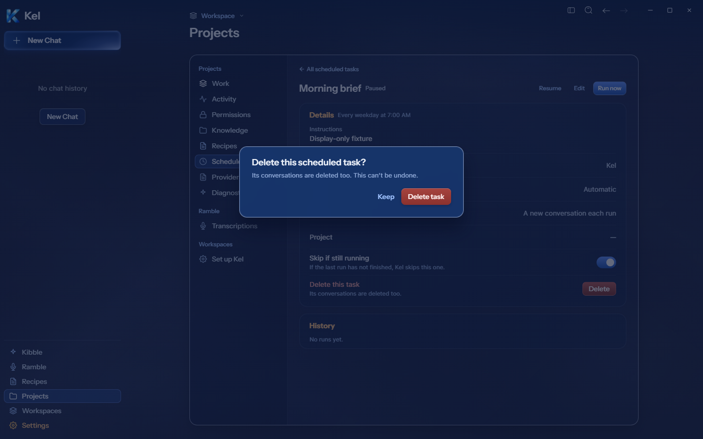
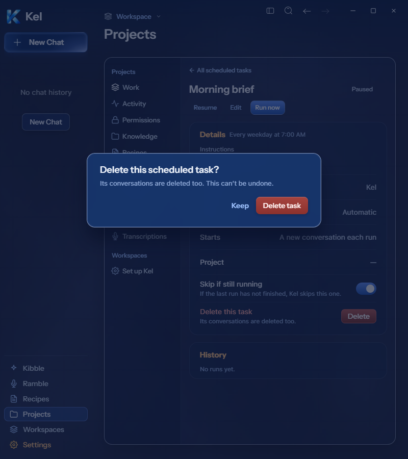

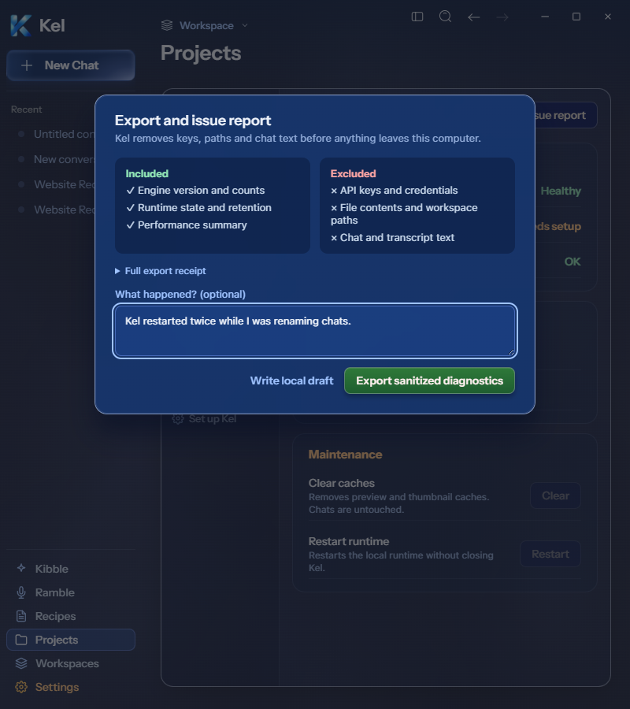
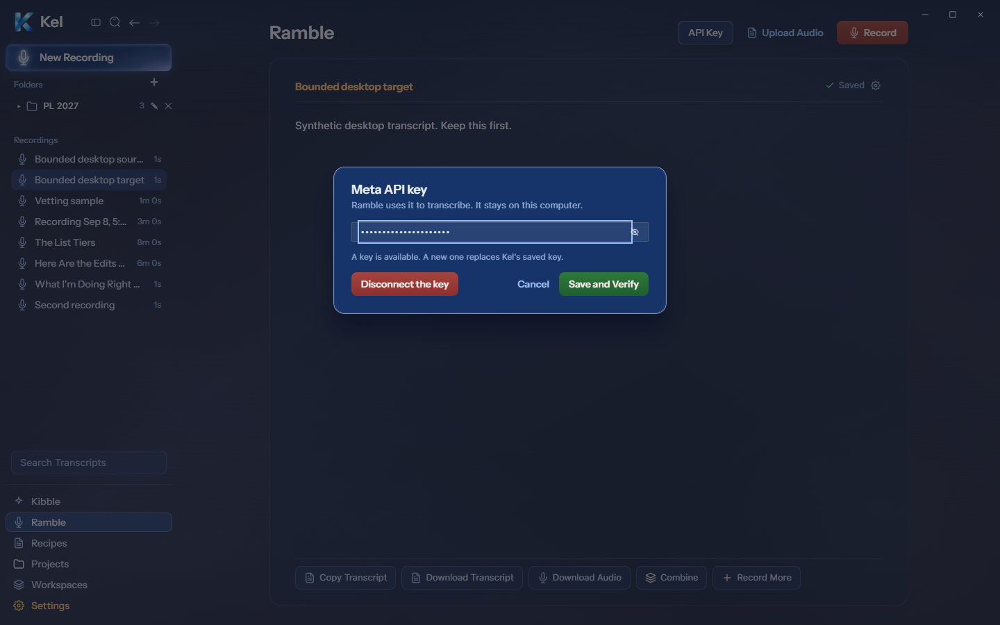

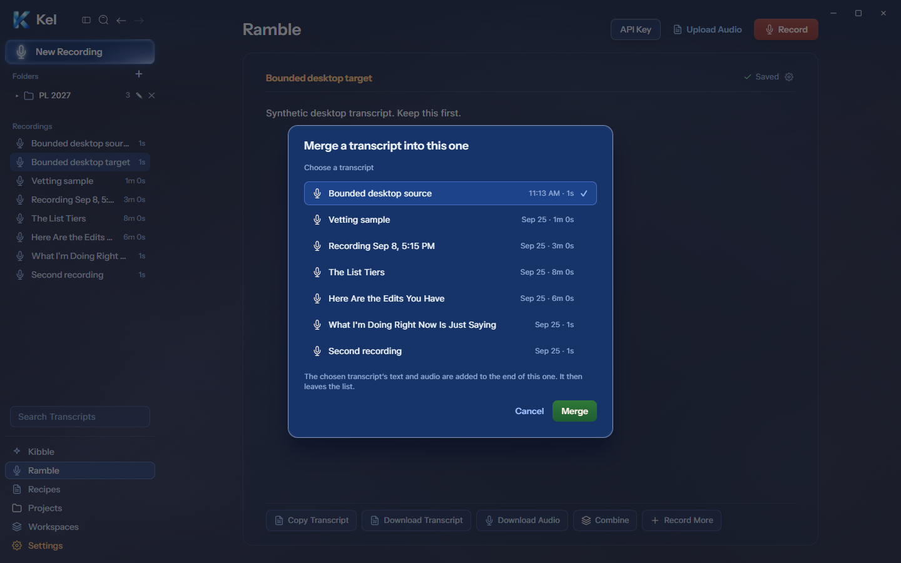
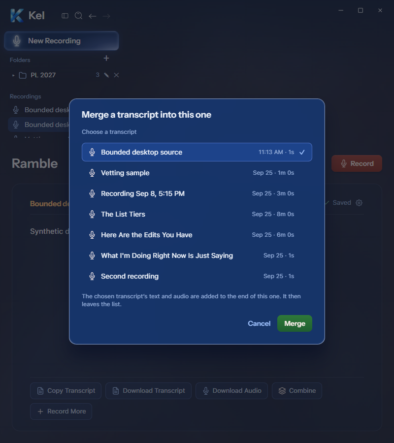

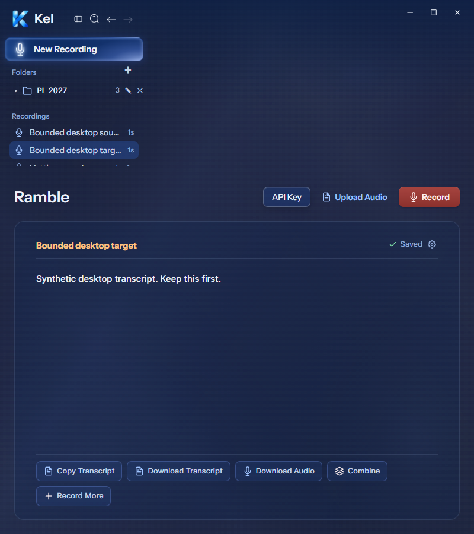
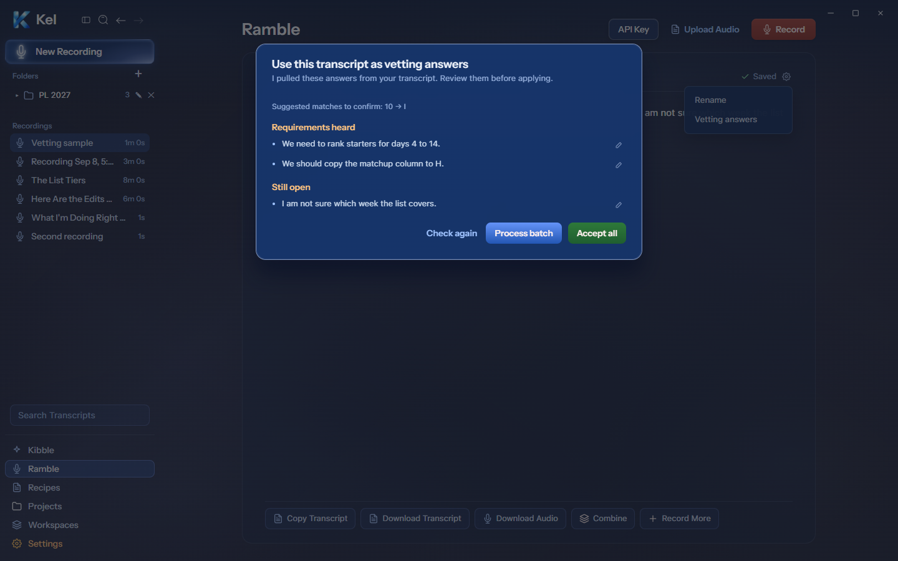
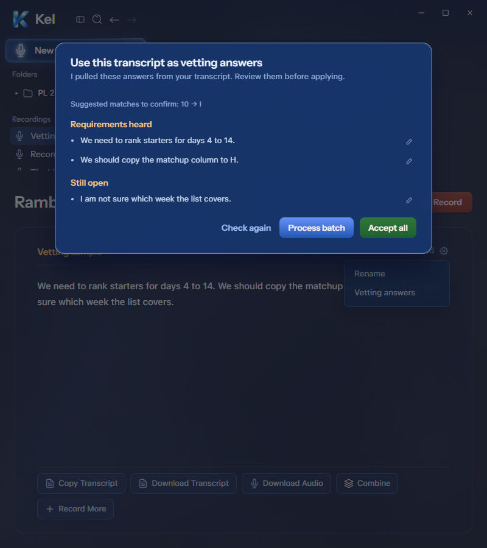
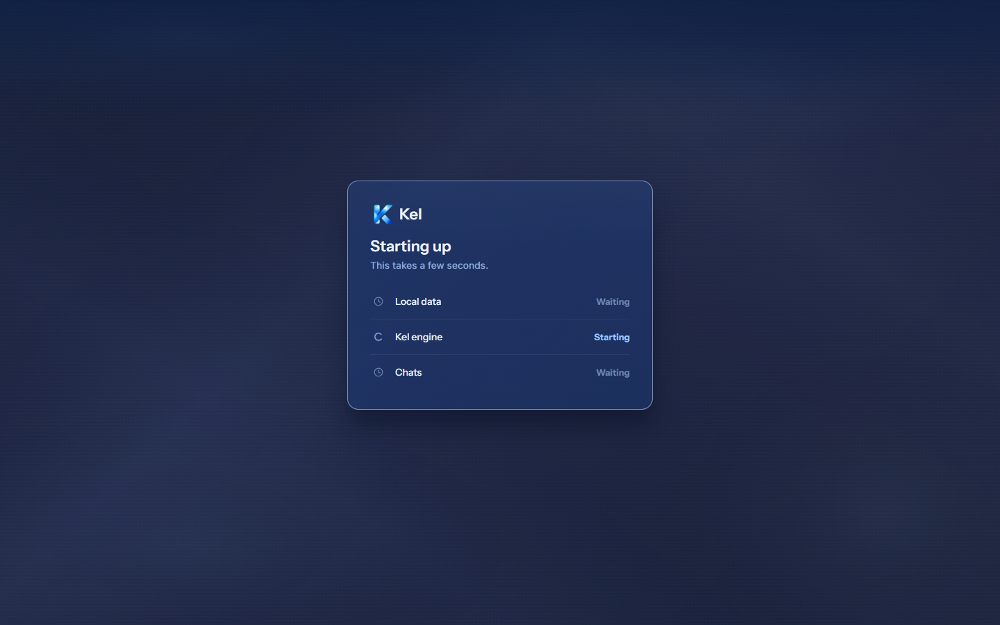
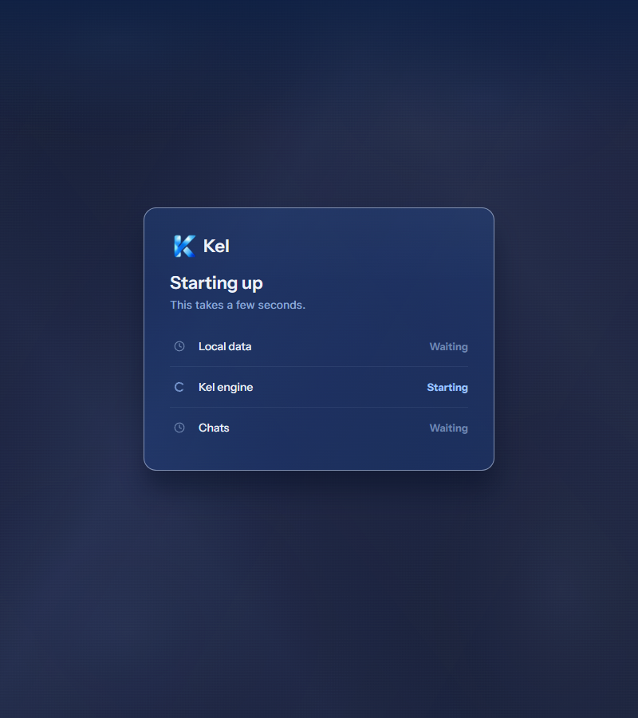
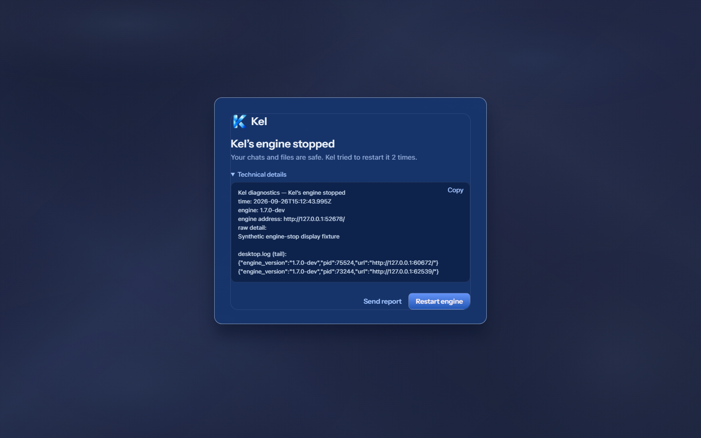
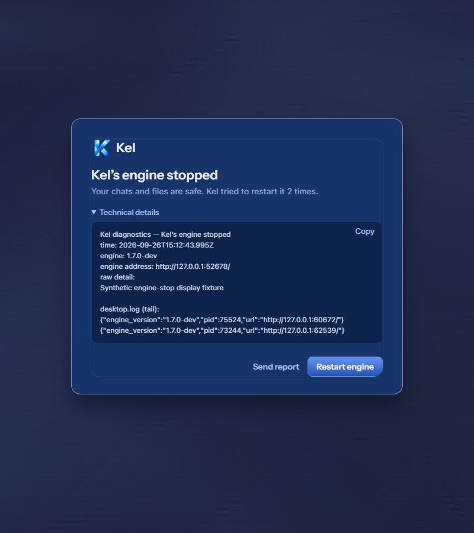
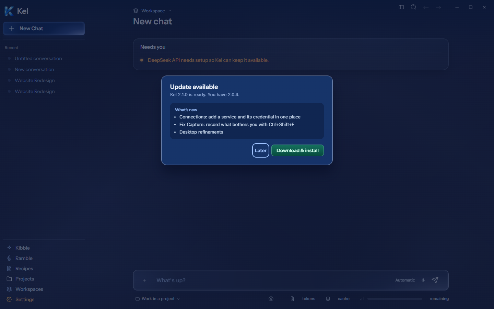
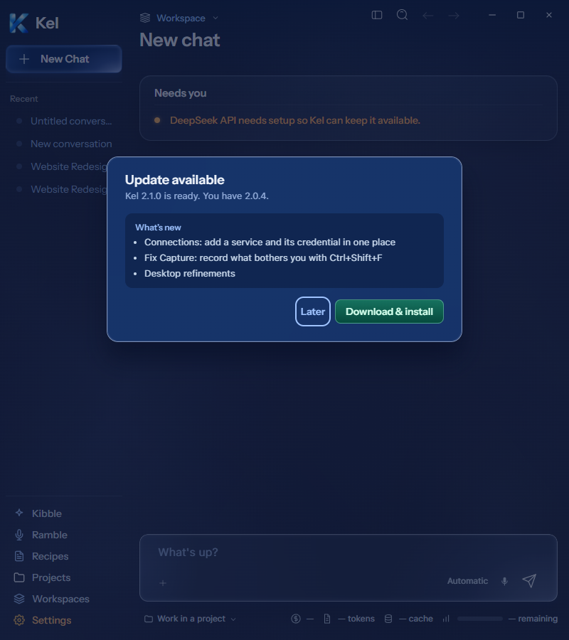
