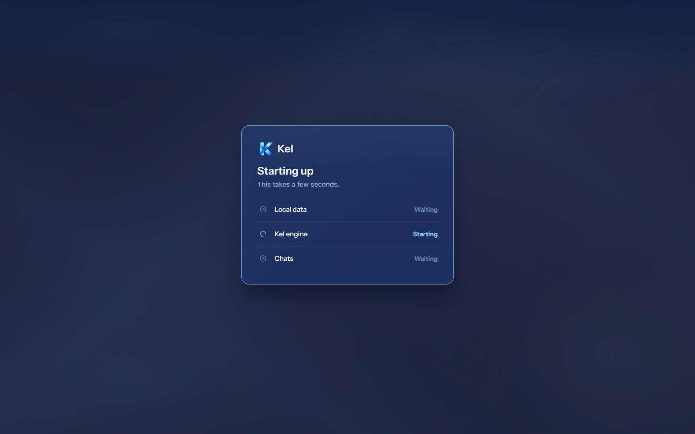
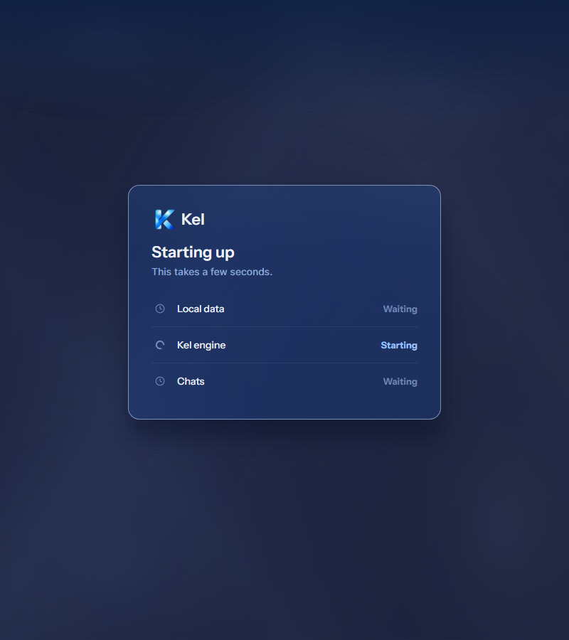
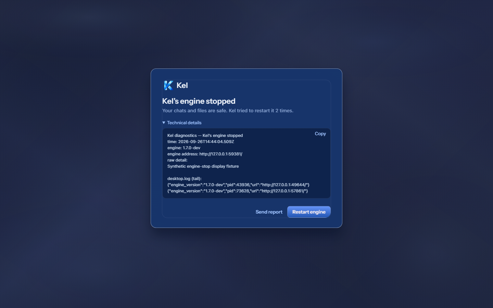
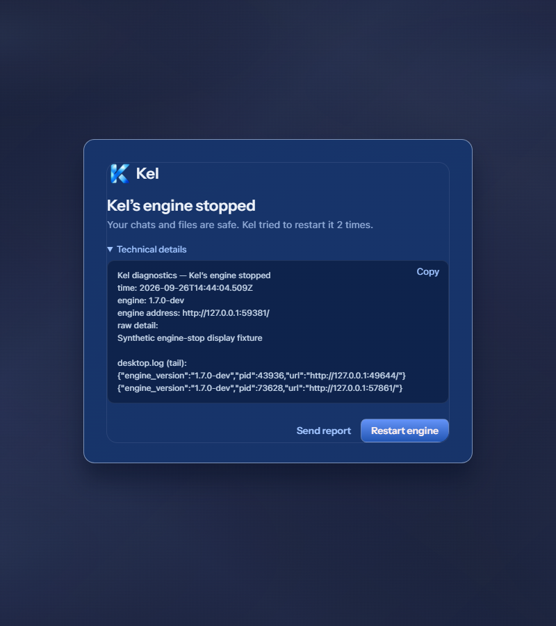
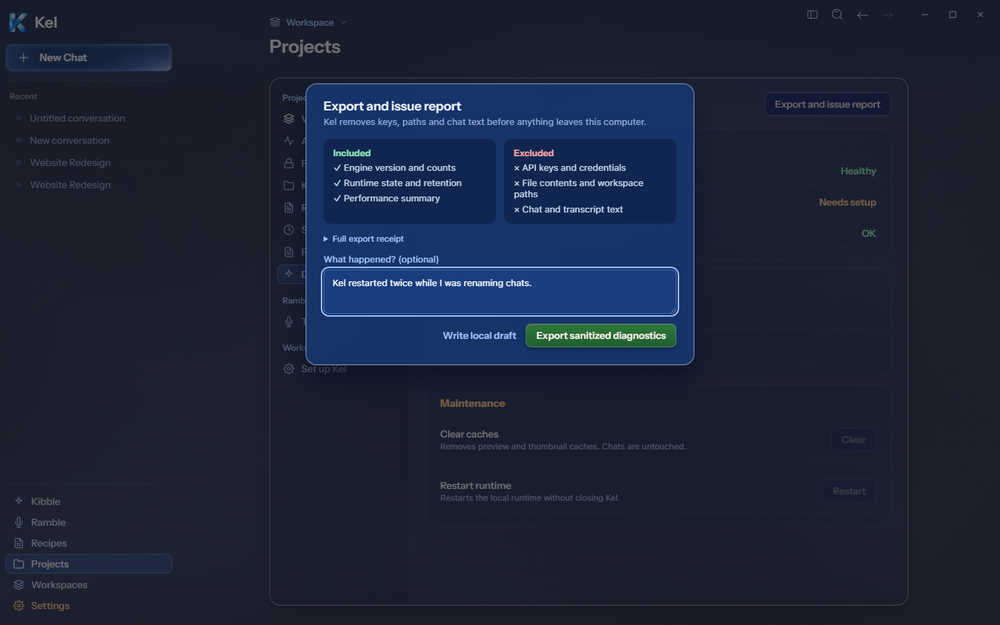

# Desktop runtime views — source evidence, 2026-09-26

Fresh Figma Starting `272:8149`, Engine not running `272:8364`, and Export diagnostics `273:11082` drove this implementation. Update available `273:10168` and Delete confirmation have since gained [shared-dialog source evidence](DESKTOP_SHARED_DIALOGS_SOURCE.md). Source checks used the current renderer in the existing isolated packaged shell. These views are not yet included in a disposable package or canonical App.

## Starting

The desktop startup card measures 440×330 at x500/y260 on 1440px, and x180/y260 on 800px. Logo, loading icon, heading, hint, and three step rows follow the frame. The actual startup gate remains authoritative. Local data stays Waiting because the bridge does not report that step's readiness; Figma's sample Ready is not fabricated. An injected pending-slow IPC event displayed the card; a ready event removed it. Reduced motion disables the spinner. This is lifecycle/render proof, not a physically slow launch. Mobile retains its existing view.

## Engine stopped

The desktop unrecoverable state now opens the engine-stopped modal. It retains actual attempt counts, diagnostics, feedback composer, and retry authority. Mobile retains the existing notice. At both widths the modal is 560px wide, horizontally centered, y200. Expanded actual diagnostics make it 466px tall. The text comes from the isolated desktop diagnostics bridge, rather than Figma's short example. No page/internal overflow or renderer errors occurred.

An injected unrecoverable event selected this view. Technical details and intercepted clipboard handoff passed at both widths. The final Restart engine click called the real isolated engine retry path and returned connected. This proves a real restart action, not a naturally occurring crash. Send report opens the existing composer; no report was submitted, and its opening was not exercised.

## Diagnostics export

The modal has a 560px surface at x440/y120 on 1440px and x120/y120 on 800px, 16px radius, and 24px blur. Its 406px height exceeds Figma's short example because it retains truthful receipt disclosure and available runtime summaries. Included/excluded panels, optional note, disclosure, retry, and actions preserve existing engine authority. There is no invented uptime/error history.

A synthetic secret-shaped note was redacted by the real report route. Export sanitized diagnostics wrote a real note-free local Markdown report inside isolated Data/diagnostics. It does not send a report or open a native save dialog. The actual output path is displayed. Escape closed the modal. Both widths had zero overflow and renderer errors.

## Validation and limits

TypeScript and final source build passed. The runtime diagnostics tests passed 17 cases. The final desktop suite result is recorded in TEST_EVIDENCE.md. Larger-milestone package verification remains pending for these source changes. Canonical App and durable Data were untouched. No external credentials or provider calls were used.

