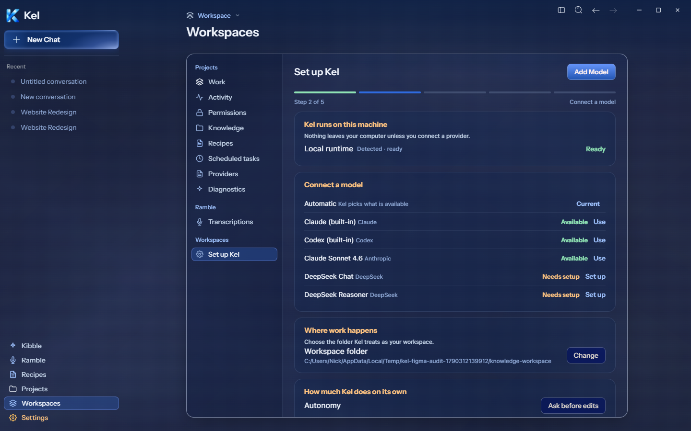
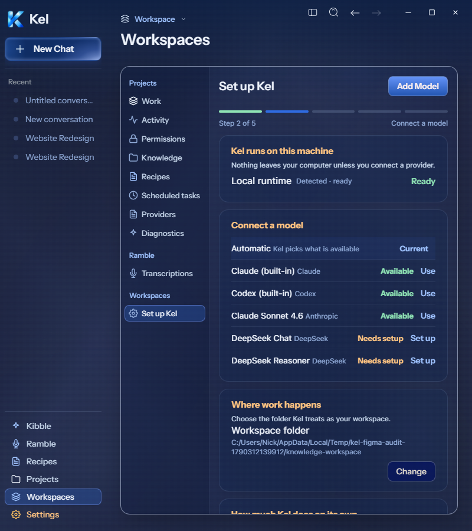
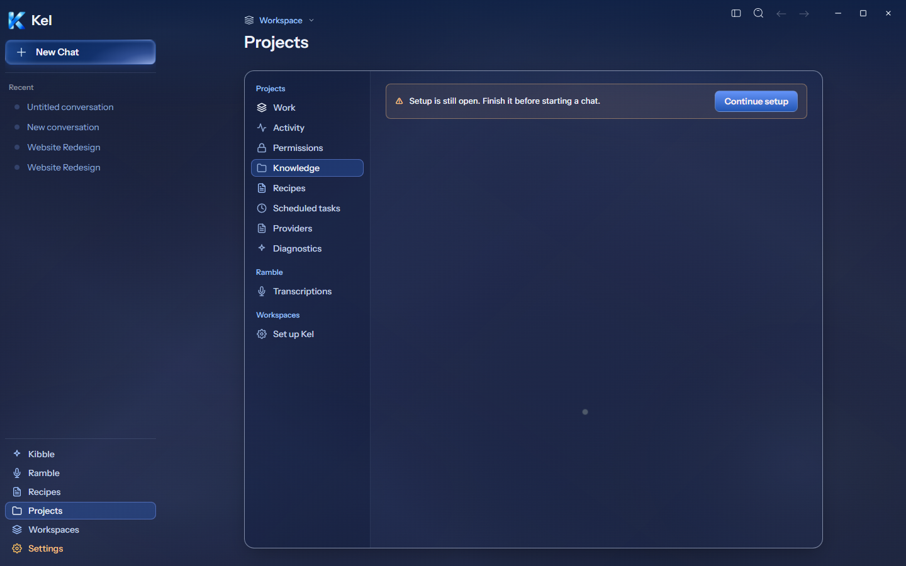
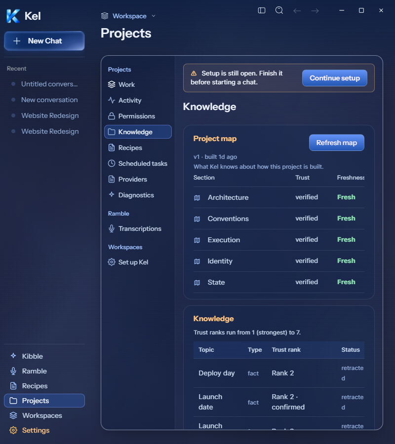

# Desktop Setup current revision — 2026-09-26

Authority: Setup `189:4492` and Setup still open `273:13646`. Setup now has five accessible progress controls and a real selected step label. Progress records navigation, not successful provider authentication. Connect a model reuses the existing default-model control and engine catalog, including real availability/default writes. Other model pages retain their existing title and behavior.

Workspace folder now shows an actual selection or No folder selected instead of a project name. Change uses the existing native directory dialog. The path is retained in setup history state and passed to the chat composer on Start using Kel. It does not establish a new global folder default. The existing setup flag remains authoritative. Mobile retains its existing project-based display and controls.

Real isolated checks passed at 1440px and 800px: Automatic wrote through the existing engine API; choosing a folder handed the intercepted native result to Setup; Start using Kel saved the completion flag and routed the selected folder to the composer. The fixture flag and model default were restored. The native OS dialog itself was not operated. No provider conversation, credential, real user configuration, or durable Data changed.

The setup-return banner now has the current warm full outline/background, warning icon, copy, and blue Continue setup action. At 1440px it measures 670×56 at x613/y133. At 800px it measures 388×58 and wraps without overflow. Continue setup routes correctly. The banner was checked on the allowed Knowledge route. Current first-run route policy redirects unfinished setup away from Work, so the full Work-plus-banner frame remains an integration gap. No false Task execution triggered toast was added.

The real model catalog has six options rather than Figma's two sample rows. Rows retain unavailable providers and setup actions, and the page scrolls. Autonomy retains the existing Ask before edits link to Permissions; an actual selectable setup policy remains open. Selected folder persistence beyond setup history/new-chat handoff, full frame parity, and package proof remain open.

TypeScript and final source build passed. Four focused tests passed: selected folder/native arguments/setup save/composer handoff, canceled picker/progress, and the existing two setup route tests. The full desktop suite passed 62 files / 433 tests. Canonical App stays `8c67121`; disposable package stays `0b4a583`. Data was untouched. Mobile remains paused.

**2026-09-26 combined milestone:** [Package record](DESKTOP_KIBBLE_SETUP_LIGHT_MILESTONE_PACKAGE.md) at 41a73f5 closes package proof only for its tested states. Sign-in is archive-browser proof with intercepted auth. Exact Kibble panel-material parity, mission recovery, Setup gaps, broader Light states, and live acceptance remain open. Canonical App remains 8c67121; Data was untouched. Historical Tools popover/Image Model checks were not repeated.
