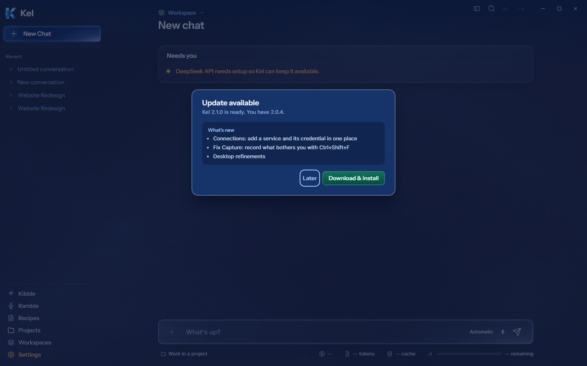
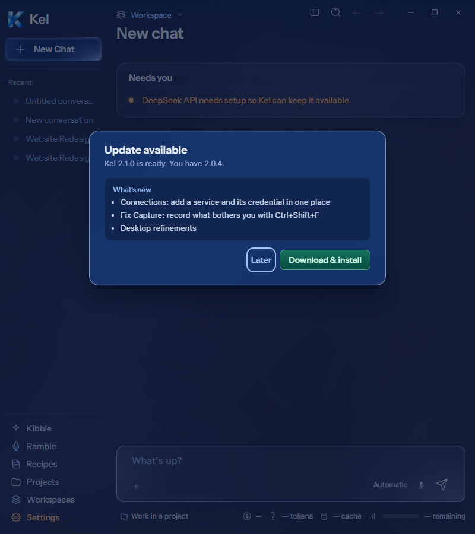
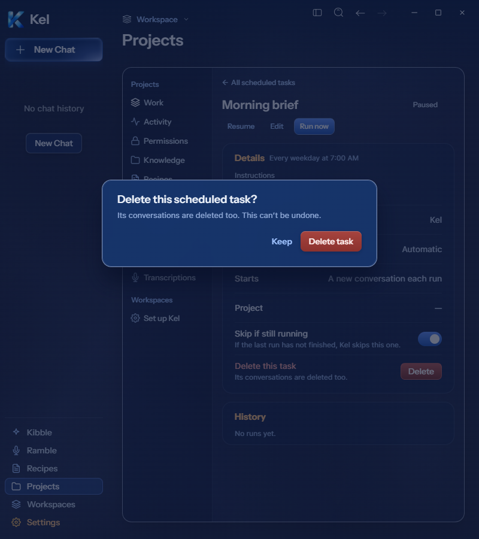

# Desktop shared dialogs — source evidence, 2026-09-26

Fresh Figma Update available `273:10168` and Delete confirmation `273:11796` drove these changes. They use existing AionModal/KelButton components and engine/update authority. Mobile retains its current UI. These are current-renderer checks in the existing isolated packaged shell, not packaged renderer proof.

## Update available

The desktop offer is now a centered 500px modal at y220: x470 on 1440px and x150 on 800px. The frame has an 18px title, actual available/current versions, inline release notes, and Later / Download & install actions. Notes use existing Markdown dependencies with compact 13px text and 400 weight. No sample release copy enters production. The fixture supplies three synthetic notes and versions, giving a 261px height; real note length changes height within a bounded scroller.

The measured surface is rgba(15,45,100,.94), radius 16px, blur 24px, with a full border and green action. Later and Escape passed at both widths. Download remains on the existing controller. It is disabled without an automatic download or recommended asset. Download, installation, and release-note external links were not invoked. Existing downloading, progress, cancel, minimize, install, error, and release-log views remain on their original path.

## Delete scheduled task

The previous inline confirmation is now the current 460×146 Figma modal at y300: x490 on 1440px and x170 on 800px. Its heading, deletion warning, Keep action, and red Delete task action match current copy and geometry. It retains the existing task/conversation deletion handler. Keep and Escape dismissed the modal at both widths. The final Delete task click invoked the existing HTTP deletion route and returned to Scheduled tasks under an intercepted response.

The task GET/DELETE responses were injected for this display-only fixture. This proves presentation, dismissal, and action handoff, not persisted task or conversation deletion. Real fixture creation was attempted but failed before a record was created: raw request setup rejected JSON, and the form lacked an eligible model. No schedule ran. The final probe wrote no task or conversation and did not call a provider. Existing backend deletion behavior was unchanged.

## Validation and limits

Both widths had zero page/internal overflow and zero renderer errors. TypeScript, the source build, and three update-policy tests passed. The earlier full 60-file/427-test suite covers the preceding runtime-view batch. No full-suite result is claimed for these later dialogs. Current runtime views and these dialogs await a larger milestone package; canonical App remains `8c67121` and durable Data was untouched.

The stopped-engine source surface also received a scoped style correction: its inner wrapper is transparent and has no second border. Final 1440/800px render/copy checks passed. Its previously verified real isolated restart was not repeated for this style change.

