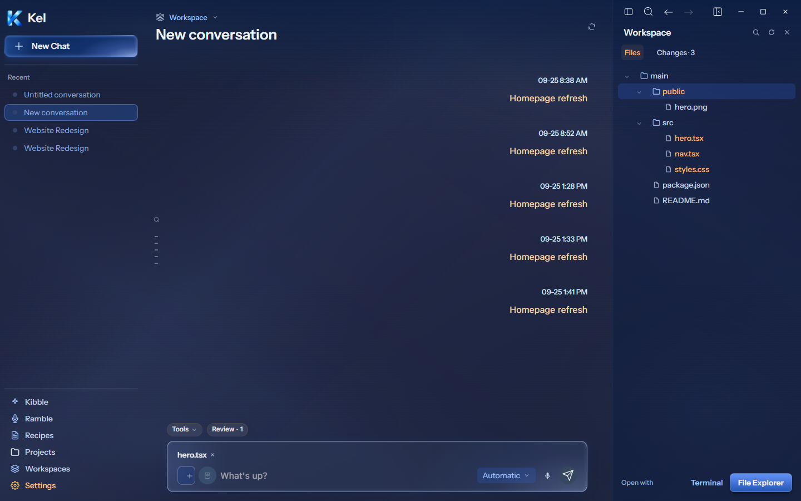
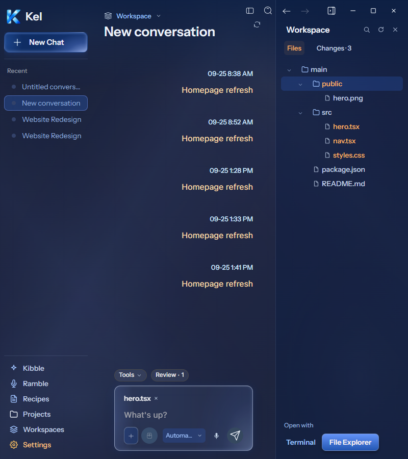
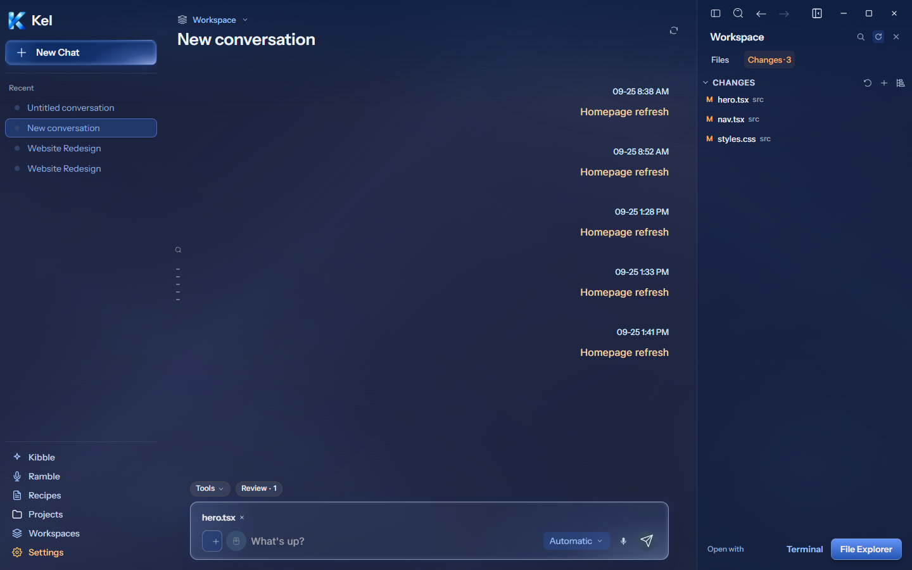
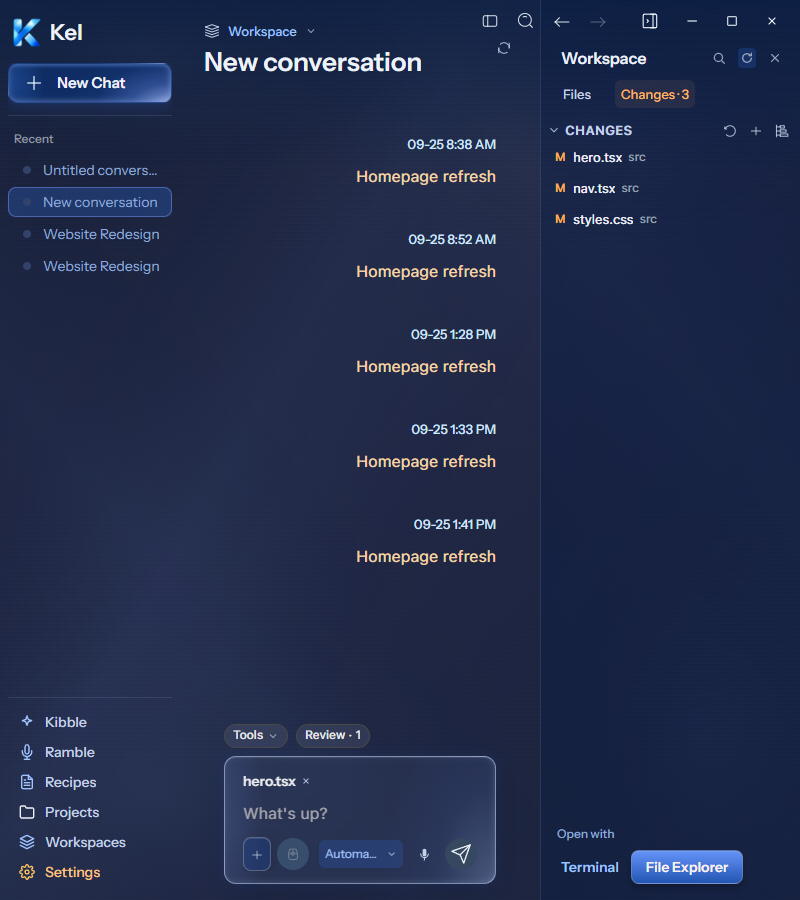
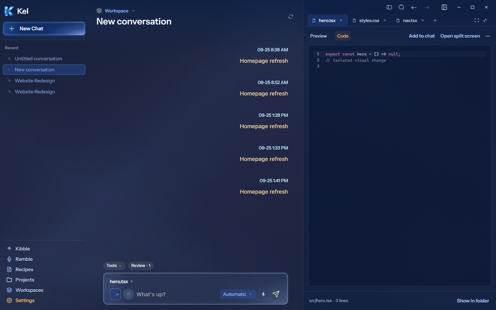
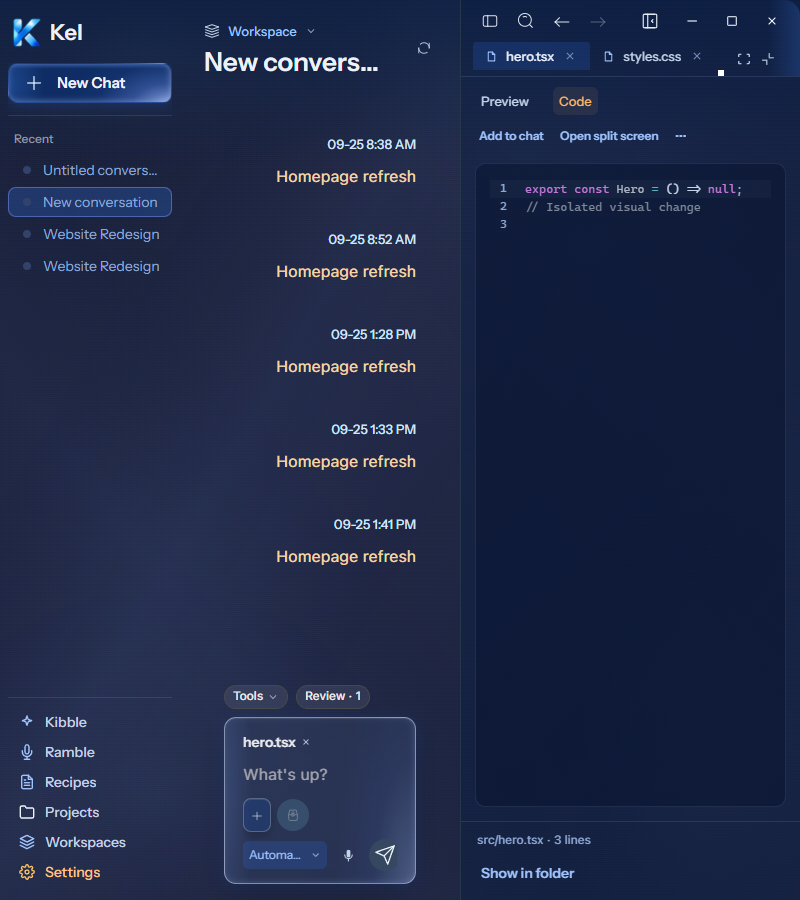

# Desktop Workspace and File preview — current Figma

The current [Workspace panel `273:13249`](https://www.figma.com/design/BlpVvZGuc9j9HhxUojIiJI/Kel-Design-System?node-id=273-13249) and [File preview `273:13459`](https://www.figma.com/design/BlpVvZGuc9j9HhxUojIiJI/Kel-Design-System?node-id=273-13459) were read directly and implemented together.

## Packaged verification — 2026-09-26

Workspace measures 340px at 1440px and contracts to 260px at 800px. Its rows measure 28px. Original folder/file/header assets render at 14px; chevrons render at 12px. The surface blends blue at 5% with the dark glass layer at 40%. The neutral structural edge uses 12% opacity. Files and Changes use 28px controls. Warm text and a subtle full fill replace the prohibited single-side selected-tab underline.

The actual disposable project contains three changed files. Its Git state supplies Changes · 3 and warm file labels. Search returns two actual hero files at both widths. Refresh, close/reopen, Collapse all, and the selected-file state pass. Add folder uses the existing native dialog bridge with an injected canceled result; no folder was attached. Terminal and File Explorer requests carry the actual disposable folder. Those requests were intercepted, so physical OS tool launch remains unverified. Open with still exposes VS Code and Browser.

File preview's outer region measures 560px at 1440px; its inner surface measures 559px after the structural border. At 800px the outer region measures 340px. Three real text files exercise the tab bar and actual content API. Tabs measure 34px. Original file and close assets render at 13px and 12px. The code surface uses a 10px radius, a full neutral border, and 12px/14px padding. The toolbar uses 10px/14px padding. CodeMirror retains syntax highlighting and editing behavior. Preview is read-only; Code enables editing; split view mounts both. File details show the actual relative path, line count, and unsaved state. The app does not invent "edited by Kel" attribution.

Add to chat produces the actual project-file attachment in the active chat. Show in folder addresses the file by project root and relative path; its OS request was intercepted. A real save reached the disposable file. The editor restored its content, then cleanup restored the original bytes. The existing editor normalizes saved CRLF text to LF. This is an existing save behavior, not byte-preserving round-trip proof. No chat was submitted.

Both views have zero document overflow and renderer errors. Checks also compare pane edges and composer button bounds; hidden clipping is not accepted as a pass. The narrow composer wraps its input and retains Send. Workspace stays mounted when temporarily hidden for a narrow preview. The native Windows titlebar requires 28px more top space than the frameless Figma samples. Saved panel widths remain supported. Fixture filenames and sorted roots reflect actual files rather than Figma's illustrative project.

TypeScript, source build, Windows package, and the final full desktop suite pass: 57 files / 415 tests. The focused Workspace/File controls passed 7 tests. Both final package scripts passed at 1440/800px with no CSS injection. All 263 renderer files in the archive match the source build. The package contains source `e77f8bb4f19be58fdf6cd4b3cd4a22c095d45075`; its archive SHA-256 is `6c89ef4287c507b021d38a40d358dc0122d3d8bbefe9f715dac1fe410bef2d30`. Canonical App still packages `8c67121`; App and durable Data are untouched. Mobile remains paused.

The isolated app closed. Automatic approval review rejected deletion of the synthetic Workspace fixture as blocked by policy. Its files and fixture Git root remain inside the existing temporary audit stack; no cleanup bypass was attempted. The separately blocked `work-appearance` folder also remains. No permanent candidate, worktree, or data root was created.

