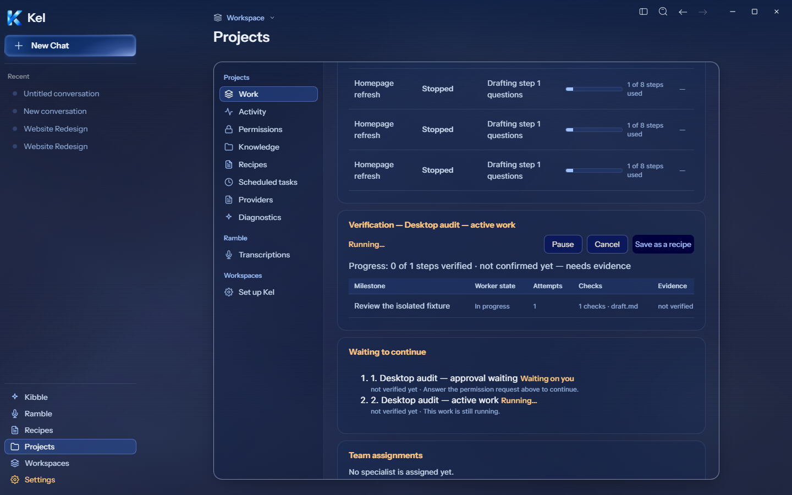
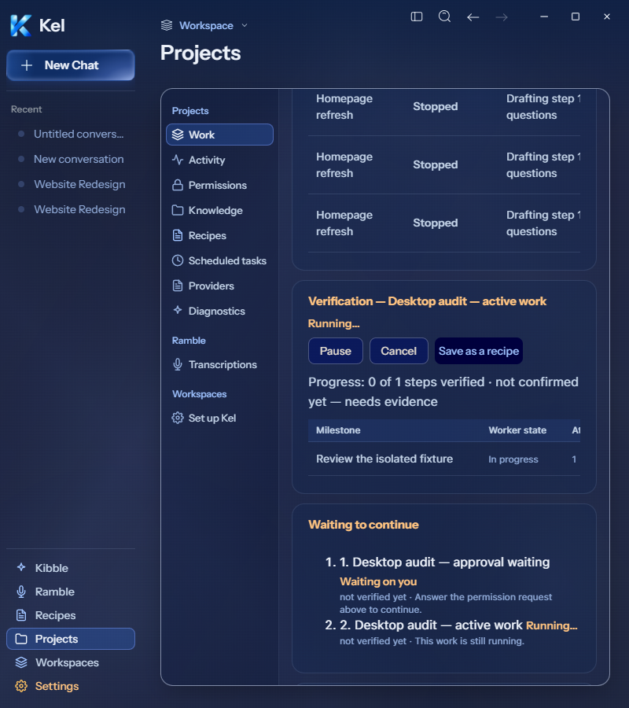
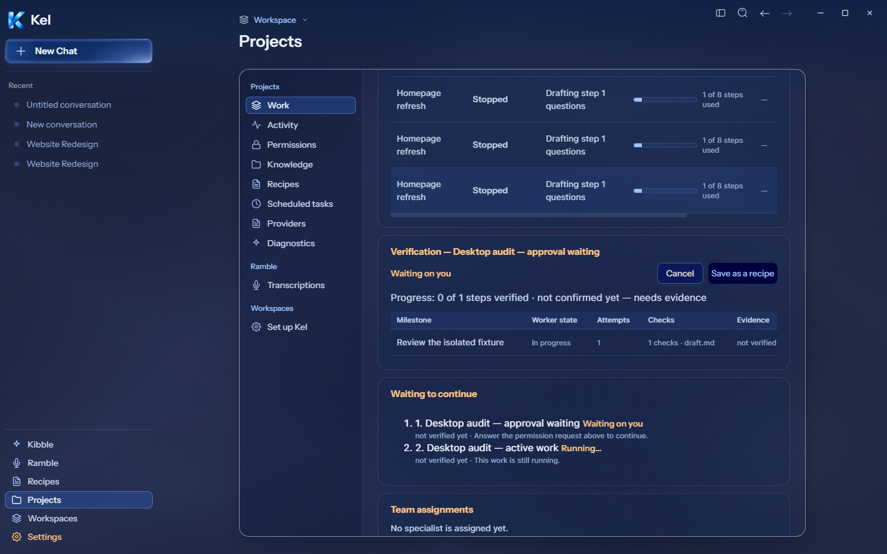
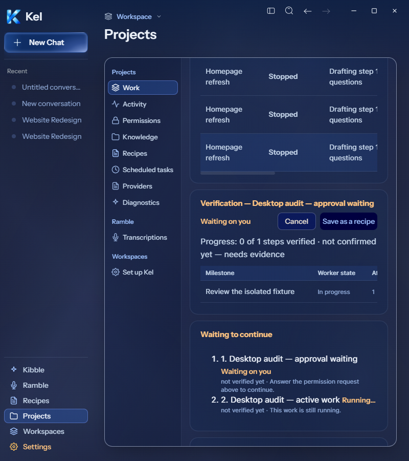
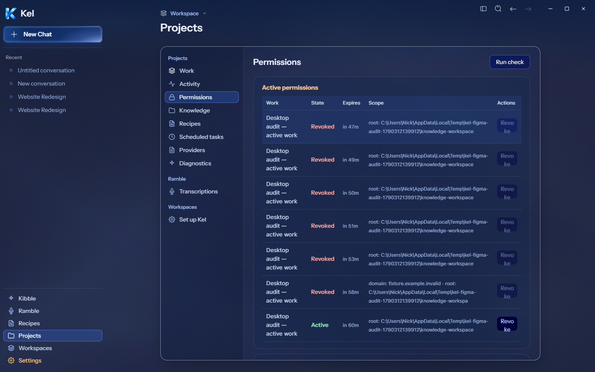
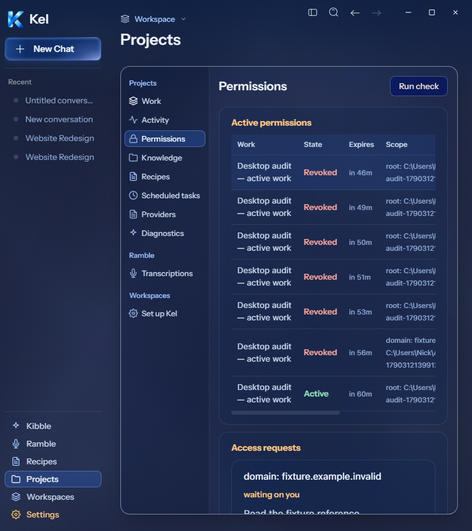

# Desktop active/waiting Work and populated Permissions

## Source acceptance — 2026-09-26

Live Figma [Work `189:907`](https://www.figma.com/design/BlpVvZGuc9j9HhxUojIiJI/Kel-Design-System?node-id=189-907) and [Permissions `189:1758`](https://www.figma.com/design/BlpVvZGuc9j9HhxUojIiJI/Kel-Design-System?node-id=189-1758) still show empty states. Populated states therefore extend their existing card, table, status, and button system; no exact populated-frame pixel match is claimed. The page shell, card surfaces, typography, and spacing remain from those current frames. No new icon or decorative rail was introduced.

The existing disposable audit root supplied real engine records. `Store.create`, `claim`, and `request_approval` produced Running and Awaiting user jobs. The fixture retained the matching action metadata and announcement needed by the normal approval route. `Autonomy.issue` and `request_expansion` produced an actual permission lease and domain request. The domain was `fixture.example.invalid`. No command, provider, network request, or canonical data was used.

Work now defaults to a running job ahead of older stopped jobs. Each job title selects its own verification detail, keeping Pause, Cancel, artifact, and recipe controls attached to that job. The current-step cell reads runtime milestones rather than repeating the first contract step. Tests cover a later running step after an accepted earlier step and recovery when the selected job disappears.

Both jobs display their actual title, state, current step, attempt count, budget, and verification result. Provider/model route copy remains conditional on engine route evidence. This fixture has no live model route. Updated remains a dash when the engine omits that field. Running and Waiting detail cards were captured at 1440px and 800px. Job and milestone tables scroll within their cards. Detail headings/actions wrap; page and card overflow is zero.

Answer request used the existing approval route and changed the waiting job to Running. It did not execute the fixture's command. The waiting detail keeps the existing cancel and recipe actions. Pause/Cancel were inspected but not clicked in this pass; fixture closure used the engine's cancel and worker-acknowledgment methods.

Permissions displays real lease scope, Active/Revoked state, expiry, boundary explanation, and guardrail digest. Historical revoked leases remain visible under the existing Active permissions heading; that is retained backend-history presentation, not an invented active grant. At narrow desktop widths the permission table scrolls. Heading and decision groups wrap without splitting button labels. Keyboard scrolling passed. Allow once persisted a domain scope with one remaining use. Revoke persisted `REVOKED`. No external access was exercised.

TypeScript and the final source build passed. The final Work/Needs-you run passed 19 tests across two files; four menu DOM tests also passed before the continuation-only repair. The new Work tests contribute six cases. The renderer reported no errors. This is source-render evidence; the larger milestone package remains pending. The canonical App still packages `8c67121`.

## Desktop labels

Fresh Figma Permission `273:9273` specifies Auto Edit. The desktop formatter now preserves that supplied mode label through the existing `autoEdit` translation. It does not add a mode or rename a differently labeled backend option. Fresh Slash `273:9737` specifies Add a file; both desktop command sources now use that copy. Work's desktop empty continuation copy is Nothing. Mobile copy remains unchanged. Permission and Slash labels passed the touched 1440/800px render checks; their prior geometry is unchanged.

## Limits and cleanup

This does not prove a live worker pause/resume, external model reply, permission enforcement against an external service, or a Figma-defined populated layout. Continuation instructions now distinguish running work, permission waits, route availability, and interrupted work. The final 1440/800px renders and focused tests cover this repair. Guardrail rules and capability enforcement were unchanged.

All new fixture jobs were canceled and acknowledged. Remaining requests were denied and leases revoked. Terminal synthetic records and the small receipt remain inside the reused temporary data root. No new permanent root, candidate, branch, or worktree was created. Canonical Data and App were untouched. Previously blocked Workspace and work-appearance folders were not retried.

## Later milestone package proof

The combined disposable package at `f8e6d86` passed these 1440/800px checks. See [milestone package evidence](DESKTOP_COMPLETION_MILESTONE_PACKAGE.md) for actions, provenance, limits, and captures. Earlier package-pending statements above are superseded. Canonical App remains `8c67121`.
